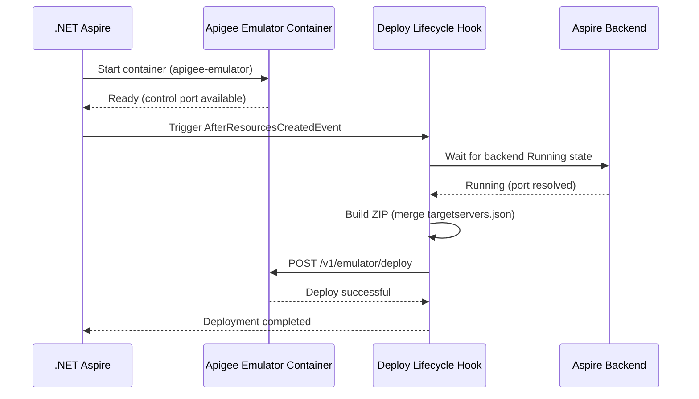
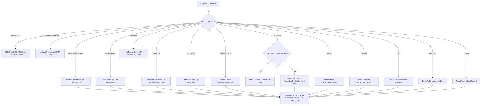

# MVFC.Aspire.Helpers.ApigeeEmulator

> 🇧🇷 [Leia em Português](README.pt-BR.md)

[](https://github.com/Marcus-V-Freitas/MVFC.Aspire.Helpers/actions/workflows/ci.yml)
[](https://codecov.io/gh/Marcus-V-Freitas/MVFC.Aspire.Helpers)
[](../../LICENSE)


Helpers for integrating the Google Apigee Emulator with .NET Aspire projects, enabling local API proxy development and testing.

## Motivation

Working with Apigee API proxies locally usually means:

- Spinning up the emulator container manually with the correct image and ports.
- Remembering to build and deploy the proxy bundle (ZIP) every time you make changes.
- Manually configuring TargetServers to point at your backend services.
- Dealing with `host.docker.internal` and port mismatches between your host and Docker.

With .NET Aspire you can define containers, but you still need to:

- Configure the emulator image, control port, and traffic port.
- Build and deploy your apiproxy bundle to the emulator on startup.
- Dynamically wire TargetServers to match the Aspire-allocated backend ports.

`MVFC.Aspire.Helpers.ApigeeEmulator` provides:

- `AddApigeeEmulator(...)` to start the emulator with sensible defaults.
- `WithWorkspace(...)` to point at your local proxy bundle and define a proxy health endpoint.
- `WithEnvironment(...)` to set the Apigee environment name.
- `WithBackend(...)` to automatically resolve Aspire backend endpoints as TargetServers.

## Overview

This project facilitates the configuration and integration of the Apigee Emulator in distributed .NET Aspire applications, providing extension methods to:

- Add the Apigee Emulator container with pre-configured ports.
- Deploy the proxy bundle (`apiproxy`) automatically on startup.
- Dynamically inject TargetServer configurations pointing at Aspire-managed backends.
- Merge static and dynamic `targetservers.json` definitions for hybrid scenarios.

## Apigee Emulator advantages

- Develop and test API proxies locally without a Google Cloud account.
- Validate traffic policies, security flows, and SharedFlows before pushing to production.
- Support Trace/Debug sessions for request inspection.
- Integrate emulator traffic with Aspire-managed backend services.

## Compatible Images

- **Emulator**
  - `gcr.io/apigee-release/hybrid/apigee-emulator` (default in this helper)

## Project Structure

- [`MVFC.Aspire.Helpers.ApigeeEmulator`](MVFC.Aspire.Helpers.ApigeeEmulator.csproj): Helpers and extensions library for Apigee Emulator.

## Features

- Adds the Apigee Emulator container with default image and ports.
- Deploys the proxy bundle automatically when the emulator is ready.
- Resolves Aspire backend ports and injects TargetServer configurations.
- Merges existing static `targetservers.json` with dynamically generated entries.
- Provides fluent AppHost configuration methods.

## Installation

```sh
dotnet add package MVFC.Aspire.Helpers.ApigeeEmulator
```

## Quick Aspire usage (AppHost)

```csharp
using Aspire.Hosting;
using MVFC.Aspire.Helpers.ApigeeEmulator;

var builder = DistributedApplication.CreateBuilder(args);

var apigeeWorkspace = Path.Combine(
    Directory.GetCurrentDirectory(),
    "apigee-workspace");

var api = builder.AddProject<Projects.MyApi>("my-api");

var apigee = builder.AddApigeeEmulator("apigee-emulator")
    .WithWorkspace(
        workspacePath: apigeeWorkspace,
        healthCheckPath: "/demo/health-check")
    .WithEnvironment("local")
    .WithBackend(api, "origin");

await builder.Build().RunAsync();
```

> [!NOTE]
> If `WithWorkspace(...)` is not called, the emulator container still starts normally, but no proxy bundle is deployed automatically.
> This is useful for manual emulator testing or when you want to control deployment outside the helper.

## Ports

| Port | Default | Description |
|---|---|---|
| Control | `7071` → `8080` (container) | Management and deploy API |
| Traffic | `8998` → `8998` (container) | API gateway traffic |

## Provisioning diagram



## Public methods

- `AddApigeeEmulator` – Adds the emulator container with default image and ports.
- `WithWorkspace` – Sets the local path to the apiproxy bundle and the proxy health check path.
- `WithEnvironment` – Sets the Apigee environment name (default: `"local"`).
- `WithDockerImage` – Overrides the Docker image and tag.
- `WithBackend` – Configures an Aspire backend as a TargetServer for the proxy.

## Runtime behavior

- The helper waits until the emulator resource reaches the `Running` state before deployment.
- It also waits for configured backend resources to become available before generating TargetServers.
- The apiproxy bundle is copied to a temporary directory, optionally merged with dynamic `targetservers.json`, zipped, deployed, and then cleaned up.
- Backend resolution supports both Aspire projects and container resources.

## Troubleshooting

### Container does not become ready

- The first startup may take longer because the emulator image needs to be downloaded locally.
- Pull the image manually before running Aspire if startup time becomes an issue:
  ```sh
  docker pull gcr.io/apigee-release/hybrid/apigee-emulator
  ```
- Check whether Docker is running and able to create containers normally.

### Bundle deploy is skipped

- Automatic deploy only happens when `WithWorkspace(...)` is configured with both a workspace path and a proxy health endpoint.
- If those values are not set, the container still starts, but the helper intentionally skips deployment.

### Backend is unreachable from the emulator

- When using `.WithBackend(...)`, the helper configures the backend endpoint to bypass the Aspire proxy.
- For ASP.NET Core projects, it also forces the backend to bind to `0.0.0.0`, which is required for Docker-to-host access.
- If you configure the backend manually, make sure the service listens on an address reachable from Docker.

### `host.docker.internal` issues on Linux

- On Linux, the helper adds `--add-host host.docker.internal:host-gateway` automatically.
- If Docker still cannot resolve it, verify that your Docker Engine supports `host-gateway`.

### Port already in use

- Override the default ports if `7071` or `8998` are already occupied:
  ```csharp
  builder.AddApigeeEmulator(
      name: "apigee-emulator",
      controlPort: 7072,
      trafficPort: 8999);
  ```

### Proxy health check never succeeds

- Confirm that the `healthCheckPath` passed to `WithWorkspace(...)` is a valid route exposed by your deployed proxy.
- If the proxy deploys successfully but that route returns non-success status codes, Aspire startup may continue retrying until timeout.

## Aspire Dashboard

Once running, the Apigee Emulator appears as a managed resource in the Aspire Dashboard alongside your backend services.

> Suggested screenshot:
> - Resource name: `apigee-emulator`
> - Status: `Running`
> - Control endpoint visible
> - Traffic endpoint visible
> - Backend service shown in the same distributed application graph

---

## Playground proxy (example only)

> The sections below document the example proxy included in the `playground/` folder.
> They describe the sample Apigee proxy used to demonstrate the helper in a realistic setup.
> They are not required to use the NuGet package itself.

## Architecture and policies of the example proxy

After validating the example project and the final configuration present in `proxies/default.xml`, this document reflects the actual routing structure, request flow, and configured policies.

## General flow diagram



## Policies implemented directly in flows

| Route / Flow | Used Policies | Practical Goal in Current Project |
|---|---|---|
| `/sharedflow-check` | `FC-CallLogging.xml` | Verifies integration with the `common-logging` SharedFlow by injecting execution headers and metadata. |
| `/spike-arrest` | `SA-SpikeArrest.xml` | Blocks interactions that exceed immediate static volumetry. |
| `OPTIONS` (All) | `AM-CorsPreflightResponse.xml` | Handles preflight validation and avoids backend forwarding. |
| `DELETE, PUT, PATCH` | `RF-MethodNotAllowed.xml` | Raises a fault for disallowed methods in this demo proxy. |
| `/notfound` | `RF-NotFound.xml` | Produces an artificial 404 response quickly through RaiseFault. |
| `/transform` | `JS-TransformResponse.xml` | Wraps backend responses using JavaScript in the response pipeline. |
| `/quota-test` | `QU-RateLimit.xml` | Restricts transactions under a defined quota window. |
| `/health-check` | `SC-HealthCheck.xml`, `EV-HealthStatus.xml`, `AM-SetHealthHeader.xml` | Calls a dependency, extracts state, and enriches headers with the result. |
| `/cached` | `LC-ResponseCache.xml`, `AM-CacheHit.xml`, `PC-ResponseCache.xml`, `AM-CacheMissHeader.xml` | Reads and populates response cache depending on hit or miss. |
| `/admin` | `AC-AllowLocalOnly.xml` | Restricts access based on allowed IP ranges. |
| `/secure` | `BA-DecodeBasicAuth.xml`, `JS-ValidateCredentials.xml`, `RF-Unauthorized.xml` | Validates Basic Auth credentials and raises Unauthorized when invalid. |
| `/xml` | `X2J-ConvertResponse.xml` | Converts XML responses to JSON before returning to the caller. |

### PostFlow policies

Whether the response comes from backend success, an intercepted response, or a planned error, the PostFlow enriches the outgoing message:

- `AM-AddCorsHeaders.xml`: Adds headers required to avoid browser CORS issues.
- `AM-AddCustomHeaders.xml`: Appends extra request and tracking metadata.
- `FC-CallLogging.xml`: Delegates shared logging behavior to the `common-logging` SharedFlow.

### Global faults

- `AM-DefaultFaultResponse.xml`: Standardizes the JSON fault payload when Apigee raises an unhandled system error.

## Requirements

- .NET 9+
- Aspire.Hosting >= 9.5.0
- Docker running locally

## License

Apache-2.0
