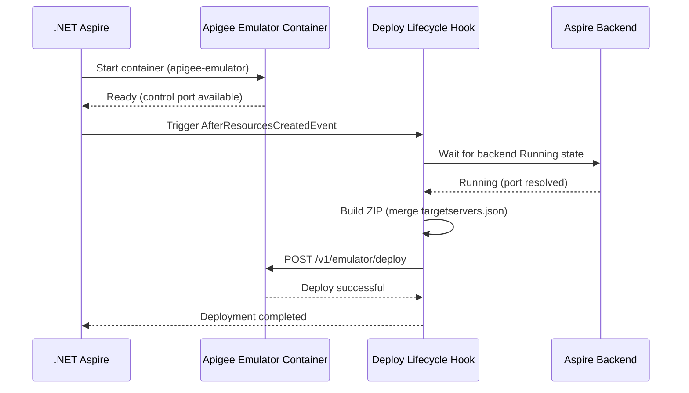
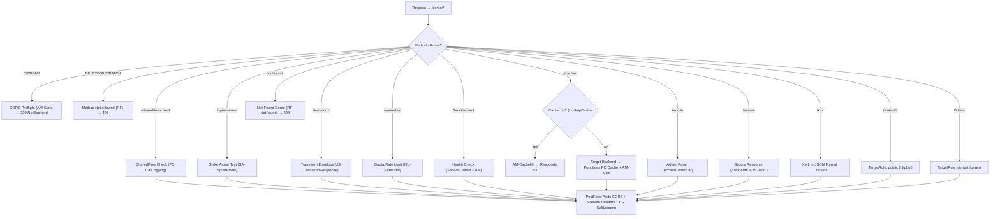

# MVFC.Aspire.Helpers.ApigeeEmulator

> 🇧🇷 [Leia em Português](README.pt-BR.md)

[](https://github.com/Marcus-V-Freitas/MVFC.Aspire.Helpers/actions/workflows/ci.yml)
[](https://codecov.io/gh/Marcus-V-Freitas/MVFC.Aspire.Helpers)
[](../../LICENSE)


Helpers for integrating the Google Apigee Emulator with .NET Aspire projects, enabling local API proxy development and testing.

## Motivation

Working with Apigee API proxies locally usually means:

- Spinning up the emulator container manually with the correct image and ports.
- Remembering to build and deploy the proxy bundle (ZIP) every time you make changes.
- Manually configuring TargetServers to point at your backend services.
- Dealing with `host.docker.internal` and port mismatches between your host and Docker.

With .NET Aspire you can define containers, but you still need to:

- Configure the emulator image, control port, and traffic port.
- Build and deploy your apiproxy bundle to the emulator on startup.
- Dynamically wire TargetServers to match the Aspire-allocated backend ports.

`MVFC.Aspire.Helpers.ApigeeEmulator` provides:

- `AddApigeeEmulator(...)` to start the emulator with sensible defaults.
- `.WithWorkspace(...)` to point at your local proxy bundle.
- `.WithEnvironment(...)` to set the Apigee environment name.
- `.WithBackend(...)` to automatically resolve Aspire backend endpoints as TargetServers.

## Overview

This project facilitates the configuration and integration of the Apigee Emulator in distributed .NET Aspire applications, providing extension methods to:

- Add the Apigee Emulator container with pre-configured ports.
- Deploy the proxy bundle (apiproxy) automatically on startup.
- Dynamically inject TargetServer configurations pointing at Aspire-managed backends.
- Merge static and dynamic TargetServer definitions for hybrid scenarios.

## Apigee Emulator advantages

- Develop and test API proxies locally without a Google Cloud account.
- Validate traffic policies, security flows, and SharedFlows before pushing to production.
- Full support for Trace/Debug sessions for request inspection.
- Seamless integration with existing Aspire-managed backend services.

## Compatible Images

- **Emulator**:
  - `gcr.io/apigee-release/hybrid/apigee-emulator` (Default in Aspire helper)

## Project Structure

- [`MVFC.Aspire.Helpers.ApigeeEmulator`](MVFC.Aspire.Helpers.ApigeeEmulator.csproj): Helpers and extensions library for Apigee Emulator.

## Features

- Adds the Apigee Emulator container with default image and ports.
- Deploys the proxy bundle automatically when the emulator is ready.
- Resolves Aspire backend ports and injects TargetServer configurations.
- Merges existing static `targetservers.json` with dynamically generated entries.
- Extension methods for fluent AppHost configuration.

## Installation

```sh
dotnet add package MVFC.Aspire.Helpers.ApigeeEmulator
```

## Quick Aspire usage (AppHost)

```csharp
using Aspire.Hosting;
using MVFC.Aspire.Helpers.ApigeeEmulator;

var builder = DistributedApplication.CreateBuilder(args);

var apigeeWorkspace = Path.Combine(Directory.GetCurrentDirectory(), "apigee-workspace");

var api = builder.AddProject<Projects.MyApi>("my-api");

var apigee = builder.AddApigeeEmulator("apigee-emulator")
                    .WithWorkspace(apigeeWorkspace)
                    .WithEnvironment("local")
                    .WithBackend(api, "origin");

await builder.Build().RunAsync();
```

## Ports

| Port | Default | Description |
|---|---|---|
| Control | `7071` → `8080` (container) | Management/deploy API |
| Traffic | `8998` → `8998` (container) | API gateway traffic |

## Provisioning diagram



## Public methods

- `AddApigeeEmulator` – adds the emulator container with default image and ports.
- `WithWorkspace` – sets the local path to the apiproxy bundle.
- `WithEnvironment` – sets the Apigee environment name (default: `"local"`).
- `WithDockerImage` – overrides the Docker image and tag.
- `WithBackend` – configures an Aspire backend as a TargetServer for the proxy.

## Architecture and Policies of the Apigee Proxy

After validating the base project and the final configuration present in `proxies/default.xml`, this document was updated to present the real routing structure, the request flow diagram, and all **22 policies** with their functions correctly applied to their respective routes.

## General Flow Diagram



---

## Policies Implemented directly in Flows

Below are detailed the applicabilities and the exact usage location of each policy configured in the emulator's XML files:

| Route / Flow | Used Policies | Practical Goal in Current Project |
|---|---|---|
| **`/sharedflow-check`** | `FC-CallLogging.xml` | Verifies integration with the `common-logging` SharedFlow by triggering the injection of execution headers and metadata. |
| **`/spike-arrest`** | `SA-SpikeArrest.xml` | Blocks interactions that exceed immediate static volumetry (sudden spikes). |
| **`OPTIONS` (All)** | `AM-CorsPreflightResponse.xml` | Validates requests without a verb (preflight), returning simulated data directly and blocking access to the target. |
| **`DELETE, PUT, PATCH`** | `RF-MethodNotAllowed.xml` | Acts as an error interceptor triggering a "Raise Fault" if someone tries to perform data deletion in this demo proxy. |
| **`/notfound`** | `RF-NotFound.xml` | Maps broken paths to generate an artificial and fast 404 response via RaiseFault. |
| **`/transform`** | `JS-TransformResponse.xml` | Awaits responses in the output pipeline and triggers a JSON wrapper script via JavaScript. |
| **`/quota-test`** | `QU-RateLimit.xml` | Regulates how many transactions this route receives per capita under a restrictive time window (5 calls/min). |
| **`/health-check`** | `SC-HealthCheck.xml` <br> `EV-HealthStatus.xml` <br> `AM-SetHealthHeader.xml` | Makes a parallel request to validate backend dependencies. Fetches the dependency, captures it using variable extraction, and injects notification Headers using AssignMessage. |
| **`/cached`** | `LC-ResponseCache.xml` <br> `AM-CacheHit.xml` <br> `PC-ResponseCache.xml` <br> `AM-CacheMissHeader.xml` | Triggers lookups and populations of optimized response Caches. In case of a hit, responds without a backend route; if it doesn't exist, advances, registers the value (*Populate*), and marks the outcome. |
| **`/admin`** | `AC-AllowLocalOnly.xml`| Emits a denial (via firewall policy) barring outsider accesses. Strictly limited by IP ranges of the machine where the Aspire container runs. |
| **`/secure`** | `BA-DecodeBasicAuth.xml` <br> `JS-ValidateCredentials.xml`<br> `RF-Unauthorized.xml`| Hard authentication routine that decrypts Base64, checks against internal JS, and blows up into an "Unauthorized" error if it fails. |
| **`/xml`** | `X2J-ConvertResponse.xml` | Restrictive conversion rule on the return gateway that ingests obsolete XML and returns well-formatted JSON to the end user. |

### PostFlow Policies (Applied to all that survive and reach the response):

Whether an intercepted return, a planned error, or a successful call to the backend, the PostFlow policies enrich the output message:
- `AM-AddCorsHeaders.xml`: Guarantees specifications to avoid browser CORS errors (Allow-Origins).
- `AM-AddCustomHeaders.xml`: Reinforces additional ID information.
- `FC-CallLogging.xml`: A delegated callout that isolates our complex logging code, passing it to the `common-logging` SharedFlow.

### Global Faults (Fault Rules Override)
- `AM-DefaultFaultResponse.xml`: An AssignMessage policy invoked by the Fault Rule when some systemic error happens in Apigee without a specific RaiseFault, modifying the ugly default output to our standard API JSON layout scope.

## Requirements

- .NET 9+
- Aspire.Hosting >= 9.5.0
- Docker running locally

## License

Apache-2.0

