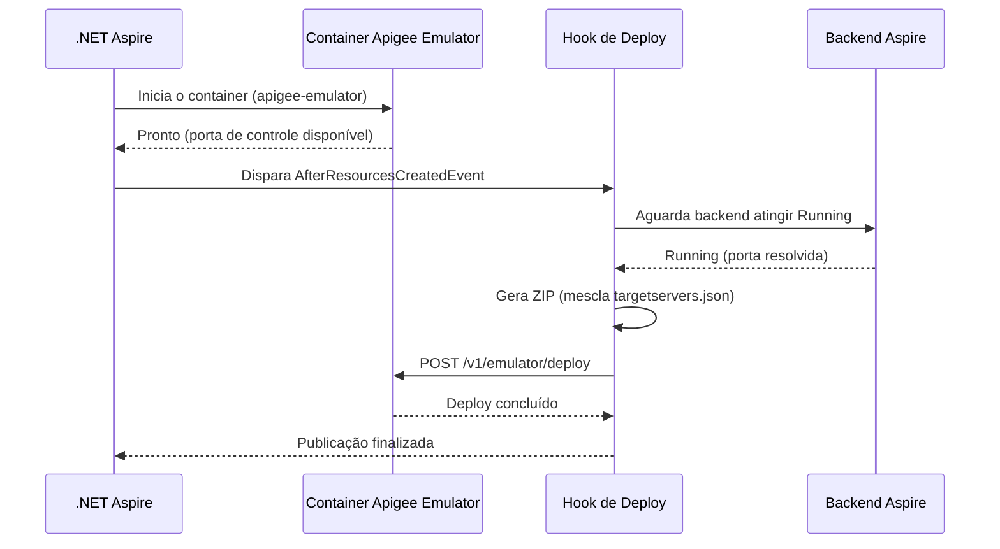
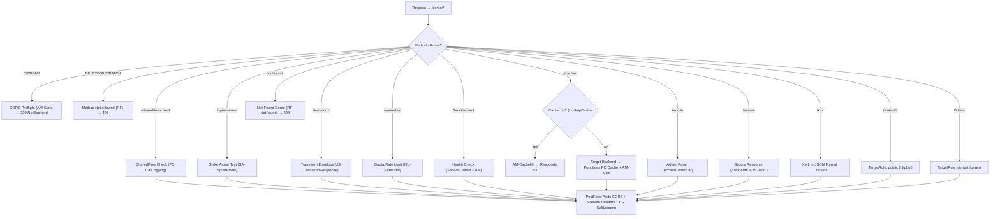

# MVFC.Aspire.Helpers.ApigeeEmulator

> 🇺🇸 [Read in English](README.md)

[](https://github.com/Marcus-V-Freitas/MVFC.Aspire.Helpers/actions/workflows/ci.yml)
[](https://codecov.io/gh/Marcus-V-Freitas/MVFC.Aspire.Helpers)
[](../../LICENSE)


Helpers para integrar o Google Apigee Emulator com projetos .NET Aspire, permitindo desenvolvimento e testes locais de API Proxies.

## Motivação

Trabalhar localmente com proxies do Apigee normalmente envolve:

- Subir o container do emulator manualmente com a imagem e portas corretas.
- Lembrar de gerar e publicar o bundle do proxy (ZIP) sempre que houver alteração.
- Configurar manualmente os TargetServers apontando para os serviços de backend.
- Lidar com `host.docker.internal` e diferenças de portas entre host e Docker.

Com .NET Aspire, você consegue declarar containers, mas ainda precisa:

- Configurar imagem do emulator, porta de controle e porta de tráfego.
- Gerar e publicar o bundle `apiproxy` na inicialização.
- Resolver dinamicamente os TargetServers com base nas portas atribuídas pelo Aspire aos backends.

`MVFC.Aspire.Helpers.ApigeeEmulator` oferece:

- `AddApigeeEmulator(...)` para iniciar o emulator com padrões sensatos.
- `WithWorkspace(...)` para apontar para o bundle local do proxy e definir um endpoint de health check do proxy.
- `WithEnvironment(...)` para definir o ambiente do Apigee.
- `WithBackend(...)` para resolver automaticamente endpoints de backend do Aspire como TargetServers.

## Visão geral

Este projeto facilita a configuração e a integração do Apigee Emulator em aplicações distribuídas com .NET Aspire, fornecendo extension methods para:

- Adicionar o container do Apigee Emulator com portas pré-configuradas.
- Publicar automaticamente o bundle do proxy (`apiproxy`) na inicialização.
- Injetar dinamicamente configurações de TargetServer apontando para backends gerenciados pelo Aspire.
- Mesclar definições estáticas e dinâmicas de `targetservers.json` em cenários híbridos.

## Vantagens do Apigee Emulator

- Desenvolver e testar proxies localmente sem depender de conta Google Cloud.
- Validar policies de tráfego, segurança e SharedFlows antes de publicar em ambientes reais.
- Utilizar Trace/Debug para inspeção de requisições.
- Integrar o tráfego do emulator com serviços de backend gerenciados pelo Aspire.

## Imagens compatíveis

- **Emulator**
  - `gcr.io/apigee-release/hybrid/apigee-emulator` (padrão deste helper)

## Estrutura do projeto

- [`MVFC.Aspire.Helpers.ApigeeEmulator`](MVFC.Aspire.Helpers.ApigeeEmulator.csproj): Biblioteca de helpers e extensões para o Apigee Emulator.

## Funcionalidades

- Adiciona o container do Apigee Emulator com imagem e portas padrão.
- Publica automaticamente o bundle do proxy quando o emulator estiver pronto.
- Resolve portas dos backends do Aspire e injeta configurações de TargetServer.
- Mescla `targetservers.json` existente com entradas dinâmicas geradas em tempo de execução.
- Fornece configuração fluente para o AppHost.

## Instalação

```sh
dotnet add package MVFC.Aspire.Helpers.ApigeeEmulator
```

## Uso rápido no Aspire (AppHost)

```csharp
using Aspire.Hosting;
using MVFC.Aspire.Helpers.ApigeeEmulator;

var builder = DistributedApplication.CreateBuilder(args);

var apigeeWorkspace = Path.Combine(
    Directory.GetCurrentDirectory(),
    "apigee-workspace");

var api = builder.AddProject<Projects.MyApi>("my-api");

var apigee = builder.AddApigeeEmulator("apigee-emulator")
    .WithWorkspace(
        workspacePath: apigeeWorkspace,
        healthCheckPath: "/demo/health-check")
    .WithEnvironment("local")
    .WithBackend(api, "origin");

await builder.Build().RunAsync();
```

> [!NOTE]
> Se `WithWorkspace(...)` não for chamado, o container do emulator será iniciado normalmente, mas nenhum bundle será publicado automaticamente.
> Isso é útil para testes manuais do emulator ou quando você quer controlar o deploy fora do helper.

## Portas

| Porta | Padrão | Descrição |
|---|---|---|
| Controle | `7071` → `8080` (container) | API de gerenciamento e deploy |
| Tráfego | `8998` → `8998` (container) | Tráfego do gateway de API |

## Diagrama de provisionamento



## Métodos públicos

- `AddApigeeEmulator` – Adiciona o container do emulator com imagem e portas padrão.
- `WithWorkspace` – Define o caminho local do bundle `apiproxy` e o path de health check do proxy.
- `WithEnvironment` – Define o nome do ambiente do Apigee (padrão: `"local"`).
- `WithDockerImage` – Sobrescreve a imagem e a tag Docker.
- `WithBackend` – Configura um backend do Aspire como TargetServer do proxy.

## Comportamento em runtime

- O helper aguarda o recurso do emulator atingir o estado `Running` antes de iniciar o deploy.
- Ele também aguarda os recursos de backend configurados ficarem disponíveis antes de gerar os TargetServers.
- O bundle do proxy é copiado para um diretório temporário, opcionalmente mesclado com `targetservers.json` dinâmico, compactado, publicado e limpo ao final.
- A resolução de backend suporta tanto projetos Aspire quanto recursos baseados em container.

## Troubleshooting

### O container não fica pronto

- A primeira inicialização pode levar mais tempo porque a imagem do emulator precisa ser baixada localmente.
- Se o tempo de startup estiver alto, faça o pull manual da imagem antes de rodar o Aspire:
  ```sh
  docker pull gcr.io/apigee-release/hybrid/apigee-emulator
  ```
- Verifique se o Docker está em execução e criando containers normalmente.

### O deploy do bundle foi ignorado

- O deploy automático só acontece quando `WithWorkspace(...)` é configurado com o caminho do workspace e o endpoint de health check do proxy.
- Se esses valores não forem definidos, o container sobe normalmente, mas o helper ignora o deploy de forma intencional.

### O backend não pode ser alcançado pelo emulator

- Ao usar `.WithBackend(...)`, o helper configura o endpoint do backend para bypass do proxy interno do Aspire.
- Para projetos ASP.NET Core, ele também força o bind em `0.0.0.0`, o que é necessário para acesso Docker-to-host.
- Se você configurar o backend manualmente, garanta que o serviço esteja escutando em um endereço acessível pelo Docker.

### Problemas com `host.docker.internal` no Linux

- No Linux, o helper adiciona automaticamente `--add-host host.docker.internal:host-gateway`.
- Se ainda assim houver falha de resolução, valide se a sua versão do Docker suporta `host-gateway`.

### Porta já está em uso

- Sobrescreva as portas padrão se `7071` ou `8998` já estiverem ocupadas:
  ```csharp
  builder.AddApigeeEmulator(
      name: "apigee-emulator",
      controlPort: 7072,
      trafficPort: 8999);
  ```

### O health check do proxy nunca fica saudável

- Confirme que o `healthCheckPath` informado em `WithWorkspace(...)` corresponde a uma rota válida exposta pelo proxy publicado.
- Se o deploy ocorrer com sucesso, mas essa rota responder com erro, a inicialização poderá continuar em retry até timeout.

---

## Proxy do playground (apenas exemplo)

> As seções abaixo documentam o proxy de exemplo incluído na pasta `playground/`.
> Elas descrevem a configuração Apigee usada para demonstrar o helper em um cenário mais realista.
> Elas não são obrigatórias para usar o pacote NuGet.

## Arquitetura e policies do proxy de exemplo

Após validar o projeto de exemplo e a configuração final presente em `proxies/default.xml`, este documento reflete a estrutura real de rotas, o fluxo da requisição e as policies configuradas.

## Diagrama geral do fluxo



## Policies implementadas diretamente nos flows

| Rota / Flow | Policies usadas | Objetivo prático no projeto atual |
|---|---|---|
| `/sharedflow-check` | `FC-CallLogging.xml` | Valida a integração com a SharedFlow `common-logging`, injetando headers e metadados de execução. |
| `/spike-arrest` | `SA-SpikeArrest.xml` | Bloqueia interações acima do volume imediato permitido. |
| `OPTIONS` (Todos) | `AM-CorsPreflightResponse.xml` | Trata preflight e evita encaminhamento ao backend. |
| `DELETE, PUT, PATCH` | `RF-MethodNotAllowed.xml` | Gera fault para métodos não permitidos neste proxy de demonstração. |
| `/notfound` | `RF-NotFound.xml` | Produz um 404 artificial rapidamente via RaiseFault. |
| `/transform` | `JS-TransformResponse.xml` | Envolve a resposta do backend com transformação JavaScript no pipeline de saída. |
| `/quota-test` | `QU-RateLimit.xml` | Restringe transações sob uma janela de quota definida. |
| `/health-check` | `SC-HealthCheck.xml`, `EV-HealthStatus.xml`, `AM-SetHealthHeader.xml` | Chama uma dependência, extrai o estado e enriquece os headers com o resultado. |
| `/cached` | `LC-ResponseCache.xml`, `AM-CacheHit.xml`, `PC-ResponseCache.xml`, `AM-CacheMissHeader.xml` | Consulta e popula cache de resposta conforme hit ou miss. |
| `/admin` | `AC-AllowLocalOnly.xml` | Restringe acesso com base em faixas de IP permitidas. |
| `/secure` | `BA-DecodeBasicAuth.xml`, `JS-ValidateCredentials.xml`, `RF-Unauthorized.xml` | Valida credenciais Basic Auth e gera Unauthorized quando inválidas. |
| `/xml` | `X2J-ConvertResponse.xml` | Converte respostas XML em JSON antes de retornar ao consumidor. |

### Policies de PostFlow

Independentemente de a resposta vir de sucesso no backend, resposta interceptada ou erro planejado, o PostFlow enriquece a mensagem de saída:

- `AM-AddCorsHeaders.xml`: Adiciona headers necessários para evitar problemas de CORS no navegador.
- `AM-AddCustomHeaders.xml`: Acrescenta metadados extras de rastreamento e identificação.
- `FC-CallLogging.xml`: Delega o comportamento compartilhado de logging para a SharedFlow `common-logging`.

### Faults globais

- `AM-DefaultFaultResponse.xml`: Padroniza o payload JSON de erro quando o Apigee gera uma falha sistêmica não tratada.

## Requisitos

- .NET 9+
- Aspire.Hosting >= 9.5.0
- Docker em execução localmente

## Licença

Apache-2.0
