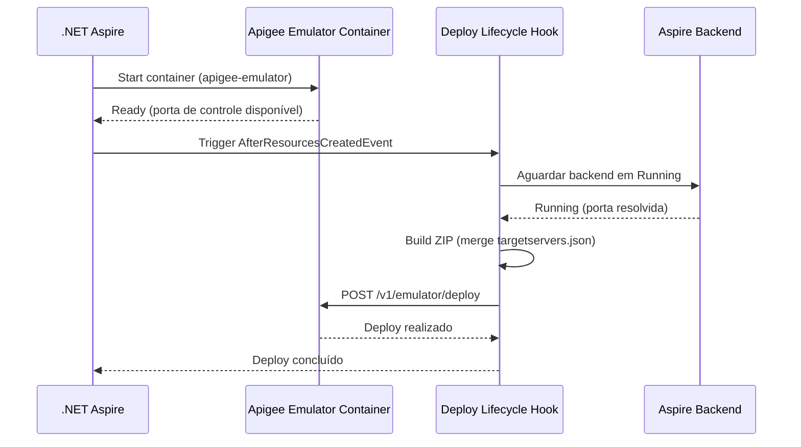
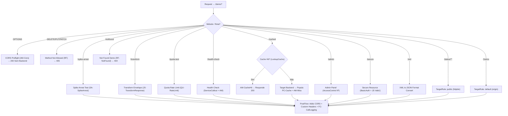

# MVFC.Aspire.Helpers.ApigeeEmulator

> 🇺🇸 [Read in English](README.md)

[](https://github.com/Marcus-V-Freitas/MVFC.Aspire.Helpers/actions/workflows/ci.yml)
[](https://codecov.io/gh/Marcus-V-Freitas/MVFC.Aspire.Helpers)
[](../../LICENSE)


Helpers para integração do Google Apigee Emulator em projetos .NET Aspire, permitindo desenvolvimento e testes locais de API proxies.

## Motivação

Trabalhar com API proxies do Apigee localmente normalmente significa:

- Subir o container do emulador na mão com a imagem e portas corretas.
- Lembrar de fazer build e deploy do bundle do proxy (ZIP) a cada alteração.
- Configurar manualmente os TargetServers apontando para os serviços backend.
- Lidar com `host.docker.internal` e divergências de portas entre host e Docker.

Com o .NET Aspire você pode definir containers, mas ainda precisa:

- Configurar a imagem do emulador, porta de controle e porta de tráfego.
- Fazer build e deploy do bundle apiproxy no emulador na inicialização.
- Resolver dinamicamente os TargetServers para as portas alocadas pelo Aspire nos backends.

O `MVFC.Aspire.Helpers.ApigeeEmulator` fornece:

- `AddApigeeEmulator(...)` para iniciar o emulador com configurações padrão.
- `.WithWorkspace(...)` para apontar para o bundle de proxy local.
- `.WithEnvironment(...)` para definir o nome do ambiente Apigee.
- `.WithBackend(...)` para resolver automaticamente endpoints de backends Aspire como TargetServers.

## Visão Geral

Este projeto facilita a configuração e integração do Apigee Emulator em aplicações distribuídas .NET Aspire, fornecendo métodos de extensão para:

- Adicionar o container do Apigee Emulator com portas pré-configuradas.
- Fazer deploy automático do bundle do proxy (apiproxy) na inicialização.
- Injetar dinamicamente configurações de TargetServer apontando para backends gerenciados pelo Aspire.
- Mesclar definições estáticas e dinâmicas de TargetServer para cenários híbridos.

## Vantagens do Apigee Emulator

- Desenvolva e teste API proxies localmente sem precisar de conta no Google Cloud.
- Valide políticas de tráfego, fluxos de segurança e SharedFlows antes de enviar para produção.
- Suporte completo a sessões de Trace/Debug para inspeção de requests.
- Integração transparente com serviços backend gerenciados pelo Aspire.

## Imagens compatíveis

- **Emulador**:
  - `gcr.io/apigee-release/hybrid/apigee-emulator` (Padrão no helper do Aspire)

## Estrutura do Projeto

- [`MVFC.Aspire.Helpers.ApigeeEmulator`](MVFC.Aspire.Helpers.ApigeeEmulator.csproj): Biblioteca de helpers e extensões para o Apigee Emulator.

## Funcionalidades

- Adiciona o container do Apigee Emulator com imagem e portas padrão.
- Faz deploy automático do bundle do proxy quando o emulador está pronto.
- Resolve portas de backends Aspire e injeta configurações de TargetServer.
- Mescla `targetservers.json` estático existente com entradas geradas dinamicamente.
- Métodos de extensão para configuração fluente no AppHost.

## Instalação

```sh
dotnet add package MVFC.Aspire.Helpers.ApigeeEmulator
```

## Uso rápido no Aspire (AppHost)

```csharp
using Aspire.Hosting;
using MVFC.Aspire.Helpers.ApigeeEmulator;

var builder = DistributedApplication.CreateBuilder(args);

var apigeeWorkspace = Path.Combine(Directory.GetCurrentDirectory(), "apigee-workspace");

var api = builder.AddProject<Projects.MyApi>("my-api");

var apigee = builder.AddApigeeEmulator("apigee-emulator")
                    .WithWorkspace(apigeeWorkspace)
                    .WithEnvironment("local")
                    .WithBackend(api, "origin");

await builder.Build().RunAsync();
```

## Portas

| Porta | Padrão | Descrição |
|---|---|---|
| Controle | `7071` → `8080` (container) | API de gerenciamento/deploy |
| Tráfego | `8998` → `8998` (container) | Tráfego do API gateway |

## Diagrama de provisionamento



## Métodos Públicos

- `AddApigeeEmulator` – adiciona o container do emulador com imagem e portas padrão.
- `WithWorkspace` – define o caminho local do bundle apiproxy.
- `WithEnvironment` – define o nome do ambiente Apigee (padrão: `"local"`).
- `WithDockerImage` – substitui a imagem e tag Docker.
- `WithBackend` – configura um backend Aspire como TargetServer para o proxy.

## Arquitetura e Políticas do Apigee Proxy

Após validar o projeto base e a configuração final presente em `proxies/default.xml`, este documento foi atualizado para apresentar a real estrutura de rotas, o diagrama do fluxo da requisição e todas as **22 políticas** com suas funções aplicadas corretamente as suas respectivas rotas.

## Diagrama Geral dos Fluxos (Atualizado)

Nesta configuração, o SpikeArrest não atua mais no `PreFlow` global, tendo sido isolado para testes na rota `/spike-arrest`.



---

## Políticas Implementadas Diretamente nos Fluxos

Abaixo estão detalhadas as aplicabilidades e o exato local de uso de cada política configurada nos arquivos XML do emulador. Diferente do rascunho inicial, cada policy se encontra associada apenas à sua condição específica:

| Rota / Fluxo | Políticas Utilizadas | Objetivo prático no projeto atual |
|---|---|---|
| **`/spike-arrest`** | `SA-SpikeArrest.xml` | Bloqueia interações que superem a volumetria estática imediata (picos repentinos). |
| **`OPTIONS` (Todos)** | `AM-CorsPreflightResponse.xml` | Valida requisições sem verbo (preflight), retornando dados simulados diretamente e barrando acesso ao target. |
| **`DELETE, PUT, PATCH`** | `RF-MethodNotAllowed.xml` | Atua como interceptador de erro disparando um "Raise Fault" caso alguém tente realizar deleção de dados neste proxy demonstrativo. |
| **`/notfound`** | `RF-NotFound.xml` | Mapeia caminhos quebrados para gerar uma resposta artificial e rápida tipo 404 pelo RaiseFault. |
| **`/transform`** | `JS-TransformResponse.xml` | Aguarda respostas na pipeline de saída e dispara um script de wrapper JSON via JavaScript. |
| **`/quota-test`** | `QU-RateLimit.xml` | Regula quantas transações esta rota recebe per-capita sob uma janela de tempo restritiva (5 cham./min). |
| **`/health-check`** | `SC-HealthCheck.xml` <br> `EV-HealthStatus.xml` <br> `AM-SetHealthHeader.xml` | Faz uma requisição paralela para validar dependências do backend. Traz a dependência, captura com extração de variávies e injeta Headers de notificação usando AssignMessage. |
| **`/cached`** | `LC-ResponseCache.xml` <br> `AM-CacheHit.xml` <br> `PC-ResponseCache.xml` <br> `AM-CacheMissHeader.xml` | Aciona pesquisas e alimentações de Cache de respostas aprimoradas. Em caso de hit, responde sem rota traseira; caso não exxita, avança, cadastra valor (*Populate*) e marca qual foi o resultado. |
| **`/admin`** | `AC-AllowLocalOnly.xml`| Emite negativa (via firewall policy) barrando acessos forasteiros. Limitado estritamente por ranges da máquina onde o contêiner Aspire roda. |
| **`/secure`** | `BA-DecodeBasicAuth.xml` <br> `JS-ValidateCredentials.xml`<br> `RF-Unauthorized.xml`| Rotina de autenticação dura que faz a quebra do Base64, checa contra JS interno e explode em erro "Unauthorized" caso falhe. |
| **`/xml`** | `X2J-ConvertResponse.xml` | Regra restritiva para conversão na porta de devolução que engole XML obsoleto e devolve JSON bem formatado ao end user. |

### Policies do PostFlow (Aplicadas a todos que sobrevivem e chegam na resposta):

Seja um retorno interceptado, erro planejado ou chamada com sucesso ao backend, as políticas de PostFlow operam o enriquecimento da mensagem de saída:
- `AM-AddCorsHeaders.xml`: Garante as especificações para evitar erro de CORS do browser (Allow-Origins).
- `AM-AddCustomHeaders.xml`: Reforça as informações adicionais dos ID's.
- `FC-CallLogging.xml`: É uma ligação delegada que isola nosso código complexado de logs passando isso para o SharedFlow `common-logging`.

### Faltas Globais (Fault Rules Override)
- `AM-DefaultFaultResponse.xml`: Uma política AssignMessage invocada pelo Fault Rule quando algum erro sistêmico acontece no Apigee sem que tenha um RaiseFault especifico, modificando a saída padrão e feia para o escopo do nosso layout em JSON da API.

## Requisitos

- .NET 9+
- Aspire.Hosting >= 9.5.0
- Docker em execução

## Licença

Apache-2.0
