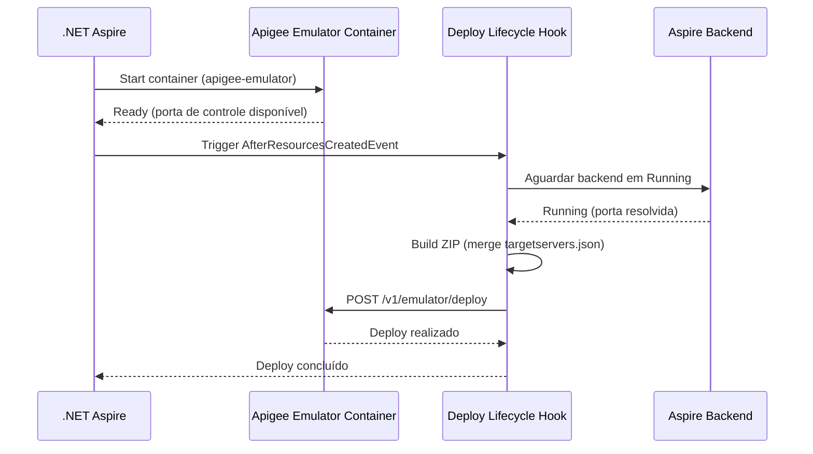

# MVFC.Aspire.Helpers.ApigeeEmulator

> 🇺🇸 [Read in English](README.md)

[](https://github.com/Marcus-V-Freitas/MVFC.Aspire.Helpers/actions/workflows/ci.yml)
[](https://codecov.io/gh/Marcus-V-Freitas/MVFC.Aspire.Helpers)
[](../../LICENSE)


Helpers para integração do Google Apigee Emulator em projetos .NET Aspire, permitindo desenvolvimento e testes locais de API proxies.

## Motivação

Trabalhar com API proxies do Apigee localmente normalmente significa:

- Subir o container do emulador na mão com a imagem e portas corretas.
- Lembrar de fazer build e deploy do bundle do proxy (ZIP) a cada alteração.
- Configurar manualmente os TargetServers apontando para os serviços backend.
- Lidar com `host.docker.internal` e divergências de portas entre host e Docker.

Com o .NET Aspire você pode definir containers, mas ainda precisa:

- Configurar a imagem do emulador, porta de controle e porta de tráfego.
- Fazer build e deploy do bundle apiproxy no emulador na inicialização.
- Resolver dinamicamente os TargetServers para as portas alocadas pelo Aspire nos backends.

O `MVFC.Aspire.Helpers.ApigeeEmulator` fornece:

- `AddApigeeEmulator(...)` para iniciar o emulador com configurações padrão.
- `.WithWorkspace(...)` para apontar para o bundle de proxy local.
- `.WithEnvironment(...)` para definir o nome do ambiente Apigee.
- `.WithBackend(...)` para resolver automaticamente endpoints de backends Aspire como TargetServers.

## Visão Geral

Este projeto facilita a configuração e integração do Apigee Emulator em aplicações distribuídas .NET Aspire, fornecendo métodos de extensão para:

- Adicionar o container do Apigee Emulator com portas pré-configuradas.
- Fazer deploy automático do bundle do proxy (apiproxy) na inicialização.
- Injetar dinamicamente configurações de TargetServer apontando para backends gerenciados pelo Aspire.
- Mesclar definições estáticas e dinâmicas de TargetServer para cenários híbridos.

## Vantagens do Apigee Emulator

- Desenvolva e teste API proxies localmente sem precisar de conta no Google Cloud.
- Valide políticas de tráfego, fluxos de segurança e SharedFlows antes de enviar para produção.
- Suporte completo a sessões de Trace/Debug para inspeção de requests.
- Integração transparente com serviços backend gerenciados pelo Aspire.

## Imagens compatíveis

- **Emulador**:
  - `gcr.io/apigee-release/hybrid/apigee-emulator` (Padrão no helper do Aspire)

## Estrutura do Projeto

- [`MVFC.Aspire.Helpers.ApigeeEmulator`](MVFC.Aspire.Helpers.ApigeeEmulator.csproj): Biblioteca de helpers e extensões para o Apigee Emulator.

## Funcionalidades

- Adiciona o container do Apigee Emulator com imagem e portas padrão.
- Faz deploy automático do bundle do proxy quando o emulador está pronto.
- Resolve portas de backends Aspire e injeta configurações de TargetServer.
- Mescla `targetservers.json` estático existente com entradas geradas dinamicamente.
- Métodos de extensão para configuração fluente no AppHost.

## Instalação

```sh
dotnet add package MVFC.Aspire.Helpers.ApigeeEmulator
```

## Uso rápido no Aspire (AppHost)

```csharp
using Aspire.Hosting;
using MVFC.Aspire.Helpers.ApigeeEmulator;

var builder = DistributedApplication.CreateBuilder(args);

var apigeeWorkspace = Path.Combine(Directory.GetCurrentDirectory(), "apigee-workspace");

var api = builder.AddProject<Projects.MyApi>("my-api")
                 .WithHttpEndpoint(port: 5050);

var apigee = builder.AddApigeeEmulator("apigee-emulator")
                    .WithWorkspace(apigeeWorkspace)
                    .WithEnvironment("local")
                    .WithBackend(api);

await builder.Build().RunAsync();
```

## Portas

| Porta | Padrão | Descrição |
|---|---|---|
| Controle | `7070` → `8080` (container) | API de gerenciamento/deploy |
| Tráfego | `8998` → `8998` (container) | Tráfego do API gateway |

## Diagrama de provisionamento



## Métodos Públicos

- `AddApigeeEmulator` – adiciona o container do emulador com imagem e portas padrão.
- `WithWorkspace` – define o caminho local do bundle apiproxy.
- `WithEnvironment` – define o nome do ambiente Apigee (padrão: `"local"`).
- `WithDockerImage` – substitui a imagem e tag Docker.
- `WithBackend` – configura um backend Aspire como TargetServer para o proxy.

## Requisitos

- .NET 9+
- Aspire.Hosting >= 9.5.0
- Docker em execução

## Licença

Apache-2.0
