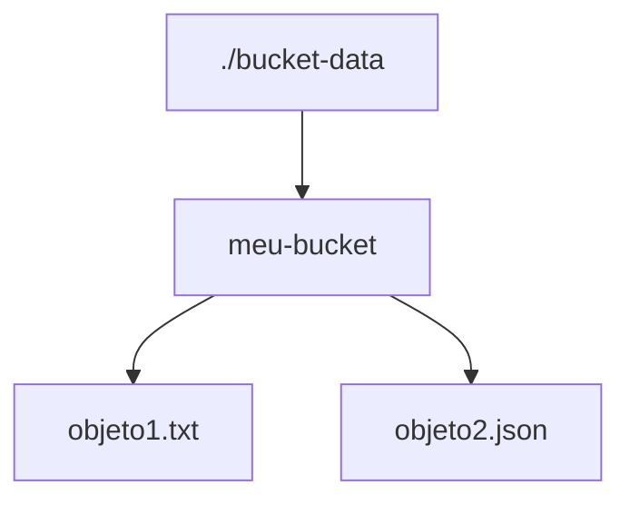

# MVFC.Aspire.Helpers.CloudStorage

Helpers para integração com Google Cloud Storage (emulador GCS) em projetos .NET Aspire.

## Visão Geral

Este projeto facilita a configuração e integração do emulador Google Cloud Storage em aplicações distribuídas .NET Aspire, fornecendo métodos de extensão para:

- Adicionar e integrar o emulador GCS.
- Permitir persistência opcional dos buckets via bind mount.

## Estrutura do Projeto

- [`MVFC.Aspire.Helpers.CloudStorage`](MVFC.Aspire.Helpers.CloudStorage.csproj): Biblioteca de helpers e extensões para Cloud Storage.

## Funcionalidades

- Adiciona o emulador GCS ao AppHost.
- Permite configuração de persistência dos buckets.
- Métodos de extensão para facilitar a configuração no AppHost.
- Exposição das funcionalidades do emulador na porta `4443`.

## Imagens compatíveis:
 - `fsouza/fake-gcs-server`

## Instalação

Adicione o pacote NuGet ao seu projeto AppHost:

```sh
dotnet add package MVFC.Aspire.Helpers.CloudStorage
```

## Exemplo de Uso no AppHost

```csharp
var builder = DistributedApplication.CreateBuilder(args);

builder.AddProject<Projects.MVFC_Aspire_Helpers_Api>("api-exemplo")
       .WithCloudStorage(builder, name: "cloud-storage", localBucketFolder: "./bucket-data");

await builder.Build().RunAsync();
```

## Montagem de Bucket a partir de Pastas

É possível montar um bucket do emulador GCS utilizando uma pasta local para persistência dos dados. Para isso, utilize o parâmetro `localBucketFolder` ao configurar o recurso no AppHost:

No exemplo acima, a pasta `./bucket-data` será utilizada pelo emulador como armazenamento persistente dos buckets. Isso permite que os dados sejam mantidos entre execuções e facilita o desenvolvimento local.

**Observação:** Certifique-se de que a pasta especificada existe e possui permissões de leitura e escrita.

## Estrutura de Pastas do Bucket de Teste

Ao utilizar o emulador GCS com bind mount, a estrutura de persistência dos buckets será semelhante a:



## Detalhes de Visualização do Emulador GCS

```
http://localhost:4443/storage/v1/b
```

```
{
  "kind": "storage#buckets",
  "items": [
    {
      "kind": "storage#bucket",
      "id": "bucket-teste",
      "defaultEventBasedHold": false,
      "name": "bucket-teste",
      "versioning": {
        "enabled": false
      },
      "timeCreated": "2025-10-29T21:59:31.923109Z",
      "updated": "2025-10-29T21:59:31.923109Z",
      "location": "US-CENTRAL1",
      "storageClass": "STANDARD",
      "projectNumber": "0",
      "metageneration": "1",
      "etag": "RVRhZw==",
      "locationType": "region"
    }
  ]
}
```

- **Visualizar objetos:**

```
http://localhost:4443/storage/v1/b/bucket-teste/o
```

Onde **bucket-teste** é o nome do bucket.

```
{
  "kind": "storage#objects",
  "items": [
    {
      "kind": "storage#object",
      "name": "teste.txt",
      "id": "bucket-teste/teste.txt",
      "bucket": "bucket-teste",
      "size": "0",
      "contentType": "text/plain; charset=utf-8",
      "crc32c": "AAAAAA==",
      "acl": [
        {
          "bucket": "bucket-teste",
          "entity": "projectOwner-test-project",
          "etag": "RVRhZw==",
          "kind": "storage#objectAccessControl",
          "object": "teste.txt",
          "projectTeam": {

          },
          "role": "OWNER"
        }
      ],
      "md5Hash": "1B2M2Y8AsgTpgAmY7PhCfg==",
      "etag": "1B2M2Y8AsgTpgAmY7PhCfg==",
      "storageClass": "STANDARD",
      "timeCreated": "2025-10-29T21:59:31.918062Z",
      "timeStorageClassUpdated": "2025-10-29T21:59:31.918148Z",
      "updated": "2025-10-29T21:59:31.918148Z",
      "generation": "1761775171918184",
      "selfLink": "http://0.0.0.0:4443/storage/v1/b/bucket-teste/o/teste.txt",
      "mediaLink": "http://0.0.0.0:4443/download/storage/v1/b/bucket-teste/o/teste.txt?alt=media",
      "metageneration": "1"
    }
  ]
}
```

## Métodos Públicos

- **AddCloudStorage**  
  Adiciona um recurso de Cloud Storage (emulador GCS) à aplicação distribuída, com opção de persistência local dos buckets.

```csharp
var cloudStorage = builder.AddCloudStorage(name: "cloud-storage", localBucketFolder: "./bucket-data");
```

- **WaitForCloudStorage**  
  Configura o projeto para aguardar a inicialização do emulador Cloud Storage e define a variável de ambiente necessária.

```csharp
builder.AddProject<Projects.MVFC_Aspire_Helpers_Playground_Api>("api-exemplo")
       .WaitForCloudStorage(cloudStorage);

```

- **WithCloudStorage**  
  Integra o emulador Cloud Storage ao projeto, configurando dependências e persistência opcional dos dados.

```csharp
builder.AddProject<Projects.MVFC_Aspire_Helpers_Playground_Api>("api-exemplo")
       .WithCloudStorage(builder, name: "cloud-storage", localBucketFolder: "./bucket-data");
```