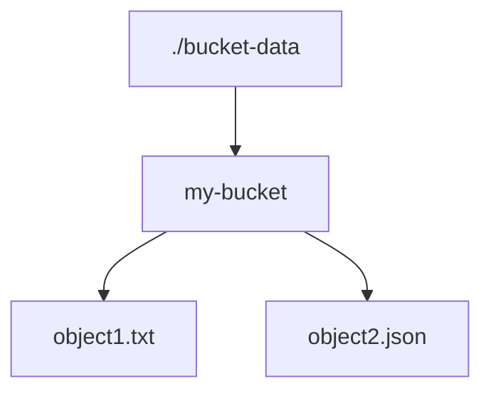

# MVFC.Aspire.Helpers.CloudStorage

> 🇧🇷 [Leia em Português](README.pt-BR.md)

Helpers for integrating with Google Cloud Storage (GCS emulator) in .NET Aspire projects.

## Overview

This project facilitates the configuration and integration of the Google Cloud Storage emulator in distributed .NET Aspire applications, providing extension methods to:

- Add and integrate the GCS emulator.
- Allow optional persistence of buckets via bind mount.

## Project Structure

- [`MVFC.Aspire.Helpers.CloudStorage`](MVFC.Aspire.Helpers.CloudStorage.csproj): Helpers and extensions library for Cloud Storage.

## Features

- Adds the GCS emulator to the AppHost.
- Allows bucket persistence configuration via a local folder.
- Extension methods to facilitate AppHost configuration.
- Exposes emulator functionalities on port `4443`.

## Compatible Images:
 - `fsouza/fake-gcs-server`

## Installation

Add the NuGet package to your AppHost project:

```sh
dotnet add package MVFC.Aspire.Helpers.CloudStorage
```

## Usage Example in AppHost

```csharp
var builder = DistributedApplication.CreateBuilder(args);

var cloudStorage = builder.AddCloudStorage("cloud-storage")
    .WithBucketFolder("./bucket-data");

builder.AddProject<Projects.MVFC_Aspire_Helpers_Playground_Api>("api-example")
       .WithReference(cloudStorage)
       .WaitFor(cloudStorage);

await builder.Build().RunAsync();
```

## Fluent Methods

| Method | Description |
|---|---|
| `WithDockerImage(image, tag)` | Overrides the Docker image used. |
| `WithBucketFolder(localPath)` | Configures a bind mount from a local folder to persist buckets. |

## `AddCloudStorage` Parameters

| Parameter | Type | Default | Description |
|---|---|---|---|
| `name` | `string` | — | Resource name. |
| `port` | `int` | `4443` | Emulator port. |

## Mounting Bucket from Folders

It is possible to mount a GCS emulator bucket using a local folder for data persistence. The specified folder will be used by the emulator as persistent storage for the buckets.

**Note:** Ensure the specified folder exists and has read and write permissions.

## Test Bucket Folder Structure


```mermaid
graph TD
    A["./bucket-data"]
    B["my-bucket"]
    C["object1.txt"]
    D["object2.json"]

    A --> B
    B --> C
    B --> D
```

## GCS Emulator Visualization Details

List buckets:
```
http://localhost:4443/storage/v1/b
```

List objects in a bucket:
```
http://localhost:4443/storage/v1/b/{bucket-name}/o
```

## Environment Variable Injected in the Project

The `WithReference` method automatically injects the `STORAGE_EMULATOR_HOST` variable with the emulator address.

## Requirements
- .NET 9+
- Aspire.Hosting >= 9.5.0

## License
Apache-2.0
