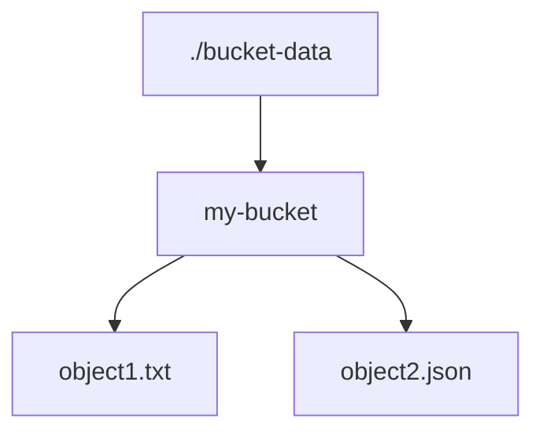

# MVFC.Aspire.Helpers.CloudStorage

> 🇧🇷 [Leia em Português](README.pt-BR.md)

[](https://github.com/Marcus-V-Freitas/MVFC.Aspire.Helpers/actions/workflows/ci.yml)
[](https://github.com/Marcus-V-Freitas/MVFC.Aspire.Helpers)
[](../../LICENSE)


Helpers for integrating with Google Cloud Storage (GCS emulator) in .NET Aspire projects.

## Motivation

When you need object storage locally, you usually:

- Spin up a GCS/S3‑compatible emulator by hand.
- Mount folders manually as bucket data.
- Hard‑code emulator URLs and ports in your services.

With .NET Aspire you can define the container, but you still need to:

- Keep the emulator configuration aligned with your applications.
- Remember which folder is mounted for which bucket.
- Inject the emulator host/port into your projects.

`MVFC.Aspire.Helpers.CloudStorage` provides:

- `AddCloudStorage(...)` to start the GCS emulator.
- `WithBucketFolder(...)` to mount a local folder as data.
- `WithReference(...)` to inject `STORAGE_EMULATOR_HOST` into your project.

## Overview

This project facilitates the configuration and integration of the Google Cloud Storage emulator in distributed .NET Aspire applications, providing extension methods to:

- Add and integrate the GCS emulator.
- Allow optional persistence of buckets via bind mount.

## Project Structure

- [`MVFC.Aspire.Helpers.CloudStorage`](MVFC.Aspire.Helpers.CloudStorage.csproj): Helpers and extensions library for Cloud Storage.

## Features

- Adds the GCS emulator to the AppHost.
- Allows bucket persistence configuration via a local folder.
- Extension methods to facilitate AppHost configuration.
- Exposes emulator functionalities on port `4443`.

## Compatible Images:

- `fsouza/fake-gcs-server`

## Installation

```sh
dotnet add package MVFC.Aspire.Helpers.CloudStorage
```

## Quick Aspire usage (AppHost)

```csharp
using Aspire.Hosting;
using MVFC.Aspire.Helpers.CloudStorage;

var builder = DistributedApplication.CreateBuilder(args);

var cloudStorage = builder.AddCloudStorage("cloud-storage")
    .WithBucketFolder("./bucket-data");

builder.AddProject<Projects.MVFC_Aspire_Helpers_Playground_Api>("api-example")
       .WithReference(cloudStorage)
       .WaitFor(cloudStorage);

await builder.Build().RunAsync();
```

## Fluent methods

| Method                          | Description                                                |
|---------------------------------|------------------------------------------------------------|
| `WithDockerImage(image, tag)`   | Overrides the Docker image used.                           |
| `WithBucketFolder(localPath)`   | Configures a bind mount from a local folder to persist buckets. |

## `AddCloudStorage` parameters

| Parameter | Type   | Default | Description     |
|----------|--------|---------|-----------------|
| `name`   | string | —       | Resource name.  |
| `port`   | int    | `4443`  | Emulator port.  |

## Mounting a bucket from folders

It is possible to mount a GCS emulator bucket using a local folder for data persistence. The specified folder will be used by the emulator as persistent storage for the buckets. Ensure the folder exists and has read/write permissions.

### Example folder structure


```mermaid
graph TD
    A["./bucket-data"]
    B["my-bucket"]
    C["object1.txt"]
    D["object2.json"]

    A --> B
    B --> C
    B --> D
```

## Emulator endpoints

- List buckets: `http://localhost:4443/storage/v1/b`  
- List objects in a bucket: `http://localhost:4443/storage/v1/b/{bucket-name}/o`

## Environment variable injected

The `WithReference` method automatically injects:

- `STORAGE_EMULATOR_HOST` – emulator address for your application.

## Requirements

- .NET 9+
- Aspire.Hosting >= 9.5.0

## License

Apache-2.0
