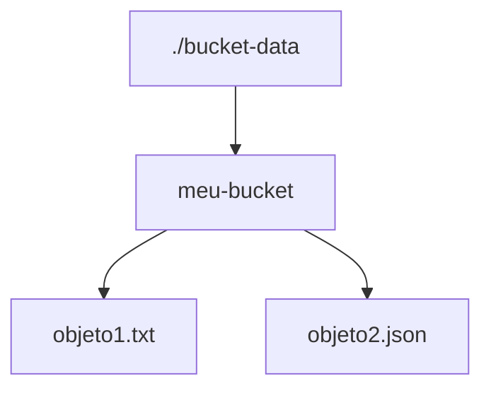

# MVFC.Aspire.Helpers.CloudStorage

> 🇺🇸 [Read in English](README.md)

[](https://github.com/Marcus-V-Freitas/MVFC.Aspire.Helpers/actions/workflows/ci.yml)
[](https://codecov.io/gh/Marcus-V-Freitas/MVFC.Aspire.Helpers)
[](../../LICENSE)


Helpers para integração com Google Cloud Storage (emulador GCS) em projetos .NET Aspire.

## Motivação

Quando você precisa de object storage localmente, normalmente:

- Sobe um emulador GCS/S3-compatível na mão.
- Monta pastas manualmente como dados de bucket.
- Deixa URLs e portas do emulador hard-code nos serviços.

Com o .NET Aspire você pode definir o container, mas ainda precisa:

- Manter a configuração do emulador alinhada com as aplicações.
- Lembrar qual pasta está montada para qual bucket.
- Injetar o host/porta do emulador nos projetos.

O `MVFC.Aspire.Helpers.CloudStorage` fornece:

- `AddCloudStorage(...)` para subir o emulador GCS.
- `WithBucketFolder(...)` para montar uma pasta local como dados.
- `WithReference(...)` para injetar `STORAGE_EMULATOR_HOST` no projeto.

## Visão Geral

Este projeto facilita a configuração e integração do emulador Google Cloud Storage em aplicações distribuídas .NET Aspire, fornecendo métodos de extensão para:

- Adicionar e integrar o emulador GCS.
- Permitir persistência opcional dos buckets via bind mount.

## Estrutura do Projeto

- [`MVFC.Aspire.Helpers.CloudStorage`](MVFC.Aspire.Helpers.CloudStorage.csproj): Biblioteca de helpers e extensões para Cloud Storage.

## Funcionalidades

- Adiciona o emulador GCS ao AppHost.
- Permite configuração de persistência dos buckets via pasta local.
- Métodos de extensão para facilitar a configuração no AppHost.
- Exposição das funcionalidades do emulador na porta `4443`.

### Imagens compatíveis

- `fsouza/fake-gcs-server`

## Instalação

```sh
dotnet add package MVFC.Aspire.Helpers.CloudStorage
```

## Uso rápido no Aspire (AppHost)

```csharp
using Aspire.Hosting;
using MVFC.Aspire.Helpers.CloudStorage;

var builder = DistributedApplication.CreateBuilder(args);

var cloudStorage = builder.AddCloudStorage("cloud-storage")
    .WithBucketFolder("./bucket-data");

builder.AddProject<Projects.MVFC_Aspire_Helpers_Playground_Api>("api-exemplo")
       .WithReference(cloudStorage)
       .WaitFor(cloudStorage);

await builder.Build().RunAsync();
```

## Métodos Fluentes

| Método                          | Descrição                                                     |
|---------------------------------|---------------------------------------------------------------|
| `WithDockerImage(image, tag)`   | Substitui a imagem Docker utilizada.                          |
| `WithBucketFolder(localPath)`   | Configura bind mount de uma pasta local para persistência dos buckets. |

## Parâmetros de `AddCloudStorage`

| Parâmetro | Tipo   | Padrão | Descrição       |
|----------|--------|--------|-----------------|
| `name`   | string | —      | Nome do recurso.|
| `port`   | int    | `4443` | Porta do emulador.|

## Montagem de Bucket a partir de Pastas

É possível montar um bucket do emulador GCS utilizando uma pasta local para persistência dos dados. A pasta especificada será utilizada pelo emulador como armazenamento persistente dos buckets. Certifique-se de que a pasta existe e possui permissões de leitura e escrita.

### Estrutura de Pastas do Bucket de Teste



## Endpoints do emulador

- Listar buckets: `http://localhost:4443/storage/v1/b`
- Listar objetos de um bucket: `http://localhost:4443/storage/v1/b/{bucket-name}/o`

## Variável de ambiente injetada

O `WithReference` injeta automaticamente:

- `STORAGE_EMULATOR_HOST` – endereço do emulador para a aplicação.

## Requisitos

- .NET 9+
- Aspire.Hosting >= 9.5.0

## Licença

Apache-2.0
