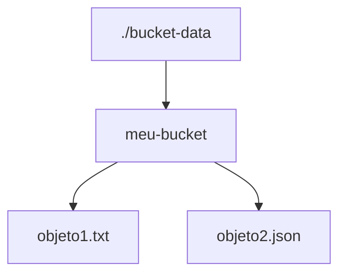

# MVFC.Aspire.Helpers.CloudStorage

> 🇺🇸 [Read in English](README.md)

Helpers para integração com Google Cloud Storage (emulador GCS) em projetos .NET Aspire.

## Visão Geral

Este projeto facilita a configuração e integração do emulador Google Cloud Storage em aplicações distribuídas .NET Aspire, fornecendo métodos de extensão para:

- Adicionar e integrar o emulador GCS.
- Permitir persistência opcional dos buckets via bind mount.

## Estrutura do Projeto

- [`MVFC.Aspire.Helpers.CloudStorage`](MVFC.Aspire.Helpers.CloudStorage.csproj): Biblioteca de helpers e extensões para Cloud Storage.

## Funcionalidades

- Adiciona o emulador GCS ao AppHost.
- Permite configuração de persistência dos buckets via pasta local.
- Métodos de extensão para facilitar a configuração no AppHost.
- Exposição das funcionalidades do emulador na porta `4443`.

## Imagens compatíveis:
 - `fsouza/fake-gcs-server`

## Instalação

Adicione o pacote NuGet ao seu projeto AppHost:

```sh
dotnet add package MVFC.Aspire.Helpers.CloudStorage
```

## Exemplo de Uso no AppHost

```csharp
var builder = DistributedApplication.CreateBuilder(args);

var cloudStorage = builder.AddCloudStorage("cloud-storage")
    .WithBucketFolder("./bucket-data");

builder.AddProject<Projects.MVFC_Aspire_Helpers_Playground_Api>("api-exemplo")
       .WithReference(cloudStorage)
       .WaitFor(cloudStorage);

await builder.Build().RunAsync();
```

## Métodos Fluentes

| Método | Descrição |
|---|---|
| `WithDockerImage(image, tag)` | Substitui a imagem Docker utilizada. |
| `WithBucketFolder(localPath)` | Configura bind mount de uma pasta local para persistência dos buckets. |

## Parâmetros de `AddCloudStorage`

| Parâmetro | Tipo | Padrão | Descrição |
|---|---|---|---|
| `name` | `string` | — | Nome do recurso. |
| `port` | `int` | `4443` | Porta do emulador. |

## Montagem de Bucket a partir de Pastas

É possível montar um bucket do emulador GCS utilizando uma pasta local para persistência dos dados. A pasta especificada será utilizada pelo emulador como armazenamento persistente dos buckets.

**Observação:** Certifique-se de que a pasta especificada existe e possui permissões de leitura e escrita.

## Estrutura de Pastas do Bucket de Teste



## Detalhes de Visualização do Emulador GCS

Listar buckets:
```
http://localhost:4443/storage/v1/b
```

Listar objetos de um bucket:
```
http://localhost:4443/storage/v1/b/{bucket-name}/o
```

## Variável de ambiente injetada no projeto

O `WithReference` injeta automaticamente a variável `STORAGE_EMULATOR_HOST` com o endereço do emulador.

## Requisitos
- .NET 9+
- Aspire.Hosting >= 9.5.0

## Licença
Apache-2.0
