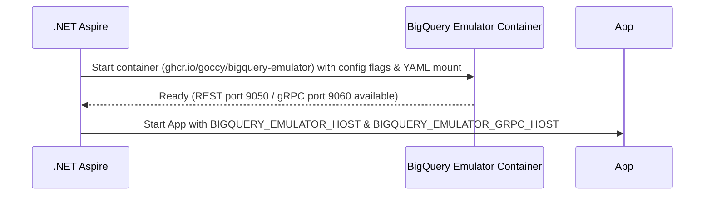

# MVFC.Aspire.Helpers.GcpBigQuery

> 🇧🇷 [Leia em Português](README.pt-BR.md)

[](https://github.com/Marcus-V-Freitas/MVFC.Aspire.Helpers/actions/workflows/ci.yml)
[](https://codecov.io/gh/Marcus-V-Freitas/MVFC.Aspire.Helpers)
[](../../LICENSE)


Helpers for integrating with Google Cloud BigQuery in .NET Aspire projects, including support for the emulator.

## Motivation

Working with Google Cloud BigQuery locally usually means:

- Spinning up an emulator container by hand.
- Remembering ports, project IDs, datasets, and environment variables.
- Manually creating datasets/tables and seeding data.

With .NET Aspire you can define containers, but you still need to:

- Configure the emulator image and its REST/gRPC ports.
- Keep emulator environment variables in sync across projects.
- Define datasets and seed mock data in a consistent way before the application runs.

`MVFC.Aspire.Helpers.GcpBigQuery` provides:

- `AddGcpBigQuery(...)` to start the emulator.
- `WithBigQueryConfigs(...)` to describe projects and default datasets in code.
- `WithDataSeed(...)` to automatically load tables and data from a local YAML file.
- `WithReference(...)` to wire projects to the emulator and inject connection configurations automatically.

## Overview

This project facilitates the configuration and integration of Google Cloud BigQuery in distributed .NET Aspire applications, providing extension methods to:

- Add the Google Cloud BigQuery emulator.
- Configure projects and datasets automatically upon startup.
- Seed data from a YAML dump file right after creation.
- Properly inject the emulator host connection string for automatic detection by BigQuery SDK clients.

## BigQuery emulator advantages

- Simulates BigQuery databases locally for development and testing.
- Allows testing schema changes and query executions without depending on Google Cloud infrastructure.
- Facilitates development of robust data warehouse implementations locally.

## Compatible Images

- **Emulator**:
  - `ghcr.io/goccy/bigquery-emulator` (Default in Aspire helper)

## Project Structure

- [`MVFC.Aspire.Helpers.GcpBigQuery`](MVFC.Aspire.Helpers.GcpBigQuery.csproj): Helpers and extensions library for BigQuery.

## Features

- Adds the Google Cloud BigQuery emulator.
- Creates projects and datasets according to configuration.
- Supports YAML seeding for initial schema and data.
- Exposes both REST and gRPC endpoints natively.
- Extension methods to facilitate AppHost configuration.

## Installation

```sh
dotnet add package MVFC.Aspire.Helpers.GcpBigQuery
```

## Quick Aspire usage (AppHost)

```csharp
using Aspire.Hosting;
using MVFC.Aspire.Helpers.GcpBigQuery;
using MVFC.Aspire.Helpers.GcpBigQuery.Models;

var builder = DistributedApplication.CreateBuilder(args);

var bigQueryConfig = new BigQueryConfig(
    ProjectId: "test-project",
    Dataset: "test_dataset"
);

var bigQuery = builder.AddGcpBigQuery("gcp-bigquery")
                      .WithBigQueryConfigs(bigQueryConfig)
                      .WithDataSeed("./bigquery-data/dump.yaml");

builder.AddProject<Projects.MVFC_Aspire_Helpers_Playground_Api>("api-example")
       .WithReference(bigQuery)
       .WaitFor(bigQuery);

await builder.Build().RunAsync();
```

## Emulated Resources Configuration

### `BigQueryConfig`

| Parameter       | Type                    | Default | Description                                   |
|-----------------|-------------------------|---------|-----------------------------------------------|
| `ProjectId`     | string                  | —       | GCP project ID.                               |
| `Dataset`       | string?                 | `null`  | Optional default dataset name.                |

## Ports

- **REST Port:** `9050`
- **gRPC Port:** `9060`

## Provisioning diagram



## Public methods

- `AddGcpBigQuery` – adds the emulator container.
- `WithBigQueryConfigs` – configures project and dataset arguments for the container.
- `WithDataSeed` – sets a local YAML file to be mounted and loaded as seed data by the emulator.
- `WithDockerImage` – allows overriding the default emulator image.
- `WithReference` – wires projects to the emulator and sets the `BIGQUERY_EMULATOR_HOST` and `BIGQUERY_EMULATOR_GRPC_HOST` environment variables automatically.

## Requirements

- .NET 9+
- Aspire.Hosting >= 13.5.3
- Docker running locally
- Google.Cloud.BigQuery.V2 >= 3.12.0

## License

Apache-2.0
