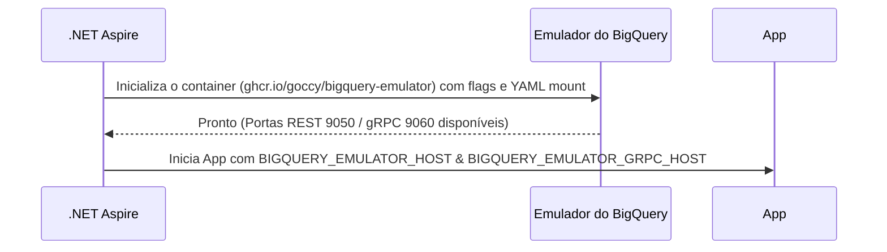

# MVFC.Aspire.Helpers.GcpBigQuery

> 🇺🇸 [Read in English](README.md)

[](https://github.com/Marcus-V-Freitas/MVFC.Aspire.Helpers/actions/workflows/ci.yml)
[](https://codecov.io/gh/Marcus-V-Freitas/MVFC.Aspire.Helpers)
[](../../LICENSE)


Helpers para integração com o Google Cloud BigQuery em projetos .NET Aspire, incluindo suporte ao emulador.

## Motivação

Trabalhar com o Google Cloud BigQuery localmente normalmente significa:

- Subir um container do emulador manualmente.
- Lembrar de portas, IDs de projetos, datasets e variáveis de ambiente.
- Criar manualmente datasets/tabelas e popular dados para testes.

Com o .NET Aspire você pode definir containers, mas ainda precisa:

- Configurar a imagem do emulador e suas portas REST/gRPC.
- Manter as variáveis de ambiente em sincronia entre os projetos.
- Definir os datasets e popular os mock data de forma padronizada antes da aplicação rodar.

O `MVFC.Aspire.Helpers.GcpBigQuery` fornece:

- `AddGcpBigQuery(...)` para iniciar o emulador.
- `WithBigQueryConfigs(...)` para descrever projetos e datasets padrão diretamente pelo código.
- `WithDataSeed(...)` para carregar tabelas e dados iniciais automaticamente através de um arquivo YAML local.
- `WithReference(...)` para conectar os projetos ao emulador e injetar configurações de conexão automaticamente.

## Visão Geral

Este projeto facilita a configuração e integração do Google Cloud BigQuery em aplicações distribuídas .NET Aspire, provendo métodos de extensão para:

- Adicionar o emulador do Google Cloud BigQuery.
- Configurar projetos e datasets automaticamente na inicialização.
- Popular dados iniciais a partir de um arquivo YAML assim que criado.
- Injetar corretamente a connection string do emulador para detecção automática pelos clientes da SDK do BigQuery.

## Vantagens do emulador do BigQuery

- Simula instâncias do BigQuery localmente para desenvolvimento e testes.
- Permite testar mudanças de schema e execução de queries sem depender da infraestrutura do Google Cloud.
- Facilita o desenvolvimento local de implementações robustas de data warehouses.

## Imagens Compatíveis

- **Emulador**:
  - `ghcr.io/goccy/bigquery-emulator` (Padrão no helper do Aspire)

## Estrutura do Projeto

- [`MVFC.Aspire.Helpers.GcpBigQuery`](MVFC.Aspire.Helpers.GcpBigQuery.csproj): Biblioteca de helpers e extensões para o BigQuery.

## Features

- Adiciona o emulador do Google Cloud BigQuery.
- Cria projetos e datasets de acordo com a configuração.
- Suporta "seed" via YAML para popular schema e dados iniciais.
- Expõe ambas as portas REST e gRPC de forma nativa.
- Métodos de extensão para facilitar a configuração do AppHost.

## Instalação

```sh
dotnet add package MVFC.Aspire.Helpers.GcpBigQuery
```

## Exemplo Rápido (AppHost)

```csharp
using Aspire.Hosting;
using MVFC.Aspire.Helpers.GcpBigQuery;
using MVFC.Aspire.Helpers.GcpBigQuery.Models;

var builder = DistributedApplication.CreateBuilder(args);

var bigQueryConfig = new BigQueryConfig(
    ProjectId: "test-project",
    Dataset: "test_dataset"
);

var bigQuery = builder.AddGcpBigQuery("gcp-bigquery")
                      .WithBigQueryConfigs(bigQueryConfig)
                      .WithDataSeed("./bigquery-data/dump.yaml");

builder.AddProject<Projects.MVFC_Aspire_Helpers_Playground_Api>("api-example")
       .WithReference(bigQuery)
       .WaitFor(bigQuery);

await builder.Build().RunAsync();
```

## Configuração dos Recursos Emulados

### `BigQueryConfig`

| Parâmetro       | Tipo                    | Padrão  | Descrição                                     |
|-----------------|-------------------------|---------|-----------------------------------------------|
| `ProjectId`     | string                  | —       | ID do projeto no GCP.                         |
| `Dataset`       | string?                 | `null`  | Nome opcional do dataset padrão.              |

## Portas

- **REST Port:** `9050`
- **gRPC Port:** `9060`

## Diagrama de provisionamento



## Métodos públicos

- `AddGcpBigQuery` – adiciona o container do emulador.
- `WithBigQueryConfigs` – configura argumentos de projeto e dataset do container.
- `WithDataSeed` – define um arquivo YAML local para ser montado e lido como seed data pelo emulador.
- `WithDockerImage` – permite sobrescrever a imagem padrão do emulador.
- `WithReference` – liga os projetos ao emulador e configura as variáveis de ambiente `BIGQUERY_EMULATOR_HOST` e `BIGQUERY_EMULATOR_GRPC_HOST` automaticamente.

## Requisitos

- .NET 9+
- Aspire.Hosting >= 13.5.3
- Docker em execução
- Google.Cloud.BigQuery.V2 >= 3.12.0

## Licença

Apache-2.0
