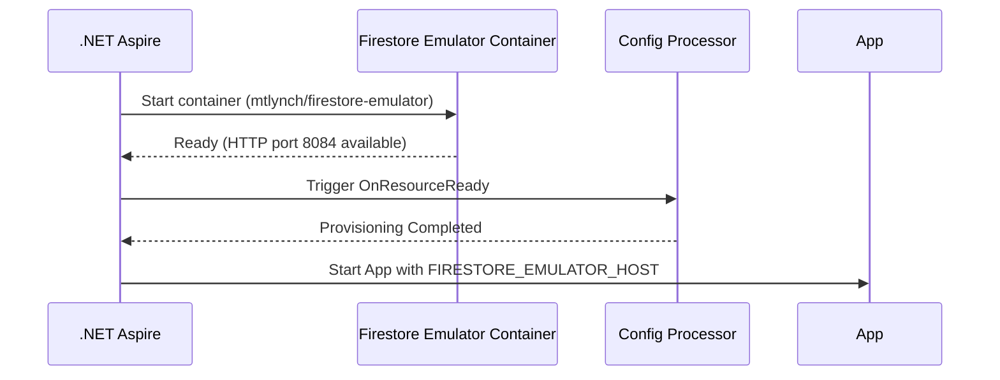

# MVFC.Aspire.Helpers.GcpFirestore

> 🇧🇷 [Leia em Português](README.pt-BR.md)

[](https://github.com/Marcus-V-Freitas/MVFC.Aspire.Helpers/actions/workflows/ci.yml)
[](https://codecov.io/gh/Marcus-V-Freitas/MVFC.Aspire.Helpers)
[](../../LICENSE)


Helpers for integrating with Google Cloud Firestore in .NET Aspire projects, including support for the emulator.

## Motivation

Working with Google Cloud Firestore locally usually means:

- Spinning up an emulator container by hand.
- Remembering ports, project IDs and environment variables.
- Manually configuring readiness checks for the emulator.

With .NET Aspire you can define containers, but you still need to:

- Configure the emulator image and its ports.
- Keep emulator environment variables in sync across projects.
- Define project configurations in a consistent way before the application runs.

`MVFC.Aspire.Helpers.GcpFirestore` provides:

- `AddGcpFirestore(...)` to start the emulator.
- `WithFirestoreConfigs(...)` to describe project configurations in code.
- `WithReference(...)` to wire projects to the emulator and inject connection configurations automatically.

## Overview

This project facilitates the configuration and integration of Google Cloud Firestore in distributed .NET Aspire applications, providing extension methods to:

- Add the Google Cloud Firestore emulator.
- Configure project IDs automatically upon startup.
- Properly inject the emulator host connection string for automatic detection by Firestore clients.

## Firestore emulator advantages

- Simulates Firestore databases locally for development and testing.
- Allows testing data operations without depending on Google Cloud infrastructure.
- Facilitates development of robust data storage implementations.

## Compatible Images

- **Emulator**:
  - `mtlynch/firestore-emulator` (Default in Aspire helper)

## Project Structure

- [`MVFC.Aspire.Helpers.GcpFirestore`](MVFC.Aspire.Helpers.GcpFirestore.csproj): Helpers and extensions library for Firestore.

## Features

- Adds the Google Cloud Firestore emulator.
- Configures project IDs according to configuration.
- Native TCP port health checks ensure the emulator is fully ready before projects start consuming it.
- Extension methods to facilitate AppHost configuration.

## Installation

```sh
dotnet add package MVFC.Aspire.Helpers.GcpFirestore
```

## Quick Aspire usage (AppHost)

```csharp
using Aspire.Hosting;
using MVFC.Aspire.Helpers.GcpFirestore;
using MVFC.Aspire.Helpers.GcpFirestore.Models;

var builder = DistributedApplication.CreateBuilder(args);

var firestoreConfig = new FirestoreConfig(
    projectId: "test-project");

var firestore = builder.AddGcpFirestore("gcp-firestore")
                       .WithFirestoreConfigs(firestoreConfig)
                       .WithWaitTimeout(15);

builder.AddProject<Projects.MVFC_Aspire_Helpers_Playground_Api>("api-example")
       .WithReference(firestore)
       .WaitFor(firestore);

await builder.Build().RunAsync();
```

## Emulated Resources Configuration

### `FirestoreConfig`

| Parameter      | Type       | Default | Description                                  |
|----------------|------------|---------|----------------------------------------------|
| `projectId`    | string     | —       | GCP project ID used by Firestore.            |

## Ports

- **HTTP Port:** `8084` *(mapped to internal port `8080` in the container)*

## Provisioning diagram



## Public methods

- `AddGcpFirestore` – adds the emulator container.
- `WithFirestoreConfigs` – configures project IDs.
- `WithWaitTimeout` – sets emulator startup delay timeout.
- `WithDockerImage` – replaces the Docker image used by the resource.
- `WithReference` – wires projects to the emulator and sets the `FIRESTORE_EMULATOR_HOST` environment variable automatically.

## Requirements

- .NET 9+
- Aspire.Hosting >= 9.5.0
- Google.Cloud.Firestore >= 3.6.0

## License

Apache-2.0
