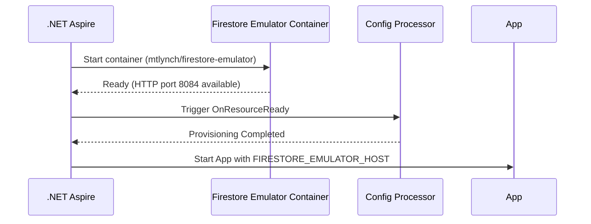

# MVFC.Aspire.Helpers.GcpFirestore

> 🇺🇸 [Read in English](README.md)

[](https://github.com/Marcus-V-Freitas/MVFC.Aspire.Helpers/actions/workflows/ci.yml)
[](https://codecov.io/gh/Marcus-V-Freitas/MVFC.Aspire.Helpers)
[](../../LICENSE)


Helpers para integração com Google Cloud Firestore em projetos .NET Aspire, incluindo suporte ao emulador.

## Motivação

Trabalhar com Google Cloud Firestore localmente normalmente significa:

- Subir um container de emulador na mão.
- Lembrar portas, project IDs e variáveis de ambiente.
- Configurar manualmente verificações de readiness para o emulador.

Com o .NET Aspire você pode definir containers, mas ainda precisa:

- Configurar a imagem do emulador e suas portas.
- Manter variáveis de ambiente do emulador em sincronia entre projetos.
- Definir configurações de projeto de forma consistente antes da aplicação rodar.

O `MVFC.Aspire.Helpers.GcpFirestore` fornece:

- `AddGcpFirestore(...)` para iniciar o emulador.
- `WithFirestoreConfigs(...)` para descrever configurações de projeto via código.
- `WithReference(...)` para ligar projetos ao emulador e injetar configurações de conexão automaticamente.

## Visão Geral

Este projeto facilita a configuração e integração do Google Cloud Firestore em aplicações distribuídas .NET Aspire, fornecendo métodos de extensão para:

- Adicionar o emulador do Google Cloud Firestore.
- Configurar project IDs automaticamente na inicialização.
- Injetar adequadamente a connection string do host do emulador para detecção automática pelos clientes do Firestore.

## Vantagens do Emulador Firestore

- Simula bancos de dados Firestore localmente para desenvolvimento e testes.
- Permite testar operações de dados sem depender da infraestrutura do Google Cloud.
- Facilita o desenvolvimento de implementações robustas de armazenamento de dados.

## Imagens compatíveis

- **Emulator**:
  - `mtlynch/firestore-emulator` (Padrão no helper do Aspire)

## Estrutura do Projeto

- [`MVFC.Aspire.Helpers.GcpFirestore`](MVFC.Aspire.Helpers.GcpFirestore.csproj): Biblioteca de helpers e extensões para Firestore.

## Funcionalidades

- Adiciona o emulador do Google Cloud Firestore.
- Configura project IDs conforme configuração.
- Validações de integridade nativas via TCP na porta garantem que o emulador esteja totalmente pronto antes dos projetos o consumirem.
- Métodos de extensão para facilitar a configuração no AppHost.

## Instalação

```sh
dotnet add package MVFC.Aspire.Helpers.GcpFirestore
```

## Uso rápido no Aspire (AppHost)

```csharp
using Aspire.Hosting;
using MVFC.Aspire.Helpers.GcpFirestore;
using MVFC.Aspire.Helpers.GcpFirestore.Models;

var builder = DistributedApplication.CreateBuilder(args);

var firestoreConfig = new FirestoreConfig(
    projectId: "test-project");

var firestore = builder.AddGcpFirestore("gcp-firestore")
                       .WithFirestoreConfigs(firestoreConfig)
                       .WithWaitTimeout(15);

builder.AddProject<Projects.MVFC_Aspire_Helpers_Playground_Api>("api-exemplo")
       .WithReference(firestore)
       .WaitFor(firestore);

await builder.Build().RunAsync();
```

## Configuração de Recursos Emulados

### `FirestoreConfig`

| Parâmetro      | Tipo       | Padrão  | Descrição                                       |
|----------------|------------|---------|--------------------------------------------------|
| `projectId`    | string     | —       | ID do projeto GCP usado pelo Firestore.          |

## Portas

- **Porta HTTP:** `8084` *(mapeada para a porta interna `8080` do container)*

## Diagrama de provisionamento



## Métodos Públicos

- `AddGcpFirestore` – adiciona o container do emulador.
- `WithFirestoreConfigs` – configura project IDs.
- `WithWaitTimeout` – define timeout do delay de inicialização do emulador.
- `WithDockerImage` – substitui a imagem Docker usada pelo recurso.
- `WithReference` – liga projetos ao emulador e configura a variável de ambiente `FIRESTORE_EMULATOR_HOST` automaticamente.

## Requisitos

- .NET 9+
- Aspire.Hosting >= 9.5.0
- Google.Cloud.Firestore >= 3.6.0

## Licença

Apache-2.0
