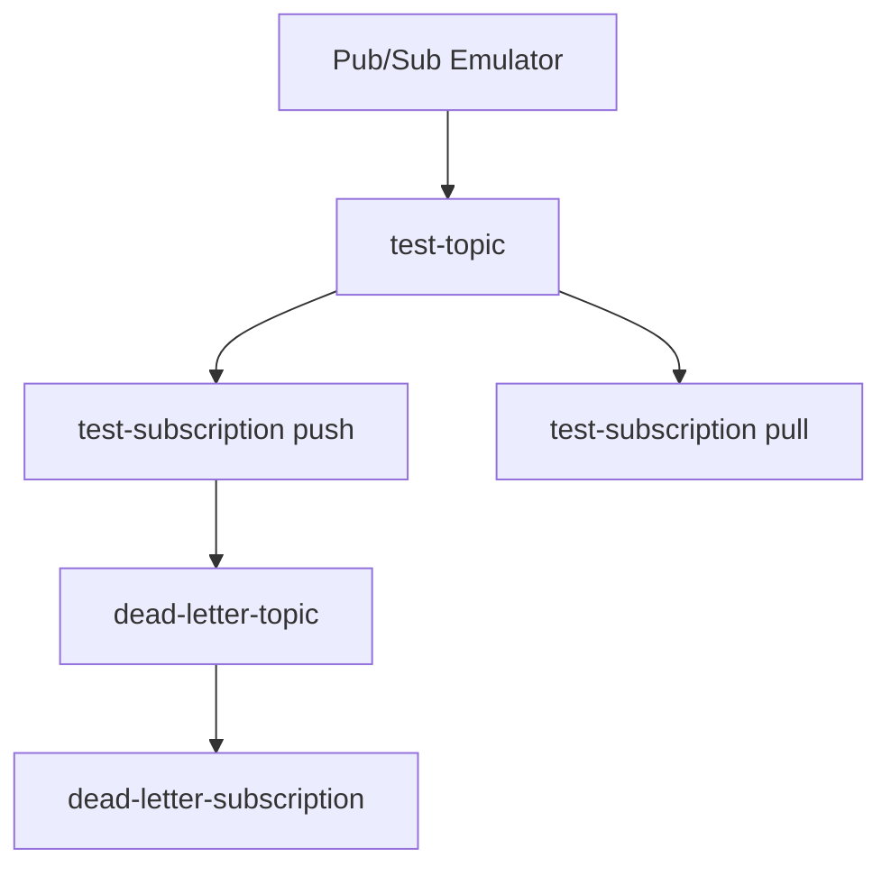

# MVFC.Aspire.Helpers.GcpPubSub

Helpers para integração com Google Pub/Sub em projetos .NET Aspire, incluindo suporte ao emulador e interface de administração (UI).

## Visão Geral

Este projeto facilita a configuração e integração do Google Pub/Sub em aplicações distribuídas .NET Aspire, fornecendo métodos de extensão para:

- Adicionar o emulador do Google Pub/Sub.
- Configurar tópicos e assinaturas automaticamente.
- Suporte a assinaturas do tipo push e pull.
- Disponibilizar interface de administração (UI) para gerenciamento.

## Vantagens do Emulador Pub/Sub

- Permite simular o fluxo de mensagens entre serviços localmente.
- Suporte a testes de assinaturas push e pull sem depender da infraestrutura do Google Cloud.
- Facilita o desenvolvimento e depuração de integrações assíncronas.

## Imagens compatíveis:
 - **Emulator**:
   - `thekevjames/gcloud-pubsub-emulator`
   - `messagebird/gcloud-pubsub-emulator`
 - **UI**:
   - `echocode/gcp-pubsub-emulator-ui`

## Estrutura do Projeto

- [`MVFC.Aspire.Helpers.GcpPubSub`](MVFC.Aspire.Helpers.GcpPubSub.csproj): Biblioteca de helpers e extensões para Pub/Sub.

## Funcionalidades

- Adiciona o emulador do Google Pub/Sub usando a imagem oficial.
- Cria tópicos e assinaturas conforme configuração.
- Suporte a assinaturas push e pull.
- Disponibiliza interface de administração (UI) para Pub/Sub.
- Métodos de extensão para facilitar a configuração no AppHost.
- Suporte a Dead Letter (DLQ).

## Instalação

Adicione o pacote NuGet ao seu projeto AppHost:

## Instalação

Adicione o pacote NuGet ao seu projeto AppHost:

```sh
dotnet add package MVFC.Aspire.Helpers.GcpPubSub
```

## Exemplo de Uso no AppHost

```csharp
var builder = DistributedApplication.CreateBuilder(args);

var messageConfig = new MessageConfig(
                            TopicName: "test-topic",
                            SubscriptionName: "test-subscription",
                            PushEndpoint: "/api/pub-sub-exit") {
    DeadLetterTopic = "test-dead-letter-topic",
    MaxDeliveryAttempts = 5,
    AckDeadlineSeconds = 300,
};

var pubSubConfig = new PubSubConfig(
                            projectId: "test-project",
                            messageConfig: messageConfig);

builder.AddProject<Projects.MVFC_Aspire_Helpers_Api>("api-exemplo")
       .WithGcpPubSub(builder, name: "gcp-pubsub", pubSubConfig: pubSubConfig);

await builder.Build().RunAsync();
```

### Configuração do Emulador

#### EmulatorConfig

A classe `EmulatorConfig` representa a configuração do emulador do Google Pub/Sub utilizado pelo helper. Ela permite definir os nomes dos recursos, imagens Docker e tags tanto do emulador Pub/Sub quanto da UI.

**Propriedades:**
- `EmulatorName`: Nome do recurso do emulador Pub/Sub.
- `UiName`: Nome do recurso da UI (default: `"pubsub-ui"`).
- `EmulatorImage`: Imagem Docker utilizada para o emulador Pub/Sub (default: `"thekevjames/gcloud-pubsub-emulator"`).
- `EmulatorTag`: Tag da imagem Docker do emulador Pub/Sub (default: `"latest"`).
- `UiImage`: Imagem Docker utilizada para a UI (default: `"echocode/gcp-pubsub-emulator-ui"`).
- `UiTag`: Tag da imagem Docker da UI (default: `"latest"`).

Utilize esta classe para customizar os contai

## Configuração de Tópicos e Assinaturas

### PubSubConfig

- `projectId`: Nome do projeto GCP.
- `MessageConfig`: Objeto com as configurações de topics/subscriptions.

### MessageConfig

- `TopicName`: Nome do tópico de mensagens.
- `SubscriptionName` **(Opcional)**: Nome da inscrição que irá receber as mensagens do tópico.
- `PushEndpoint` **(Opcional)**: Endpoint HTTP para receber mensagens automaticamente (push).
- `DeadLetterTopic` **(Opcional)**: Define o nome do tópico de Dead Letter (DLQ) para onde mensagens não processadas após o número máximo de tentativas serão enviadas.
- `MaxDeliveryAttempts` **(Opcional)**: Especifica o número máximo de tentativas de entrega antes de enviar a mensagem para o Dead Letter Topic.
- `AckDeadlineSeconds` **(Opcional)**: Define o tempo (em segundos) que o Pub/Sub aguarda pela confirmação (ack) do processamento da mensagem.

**Observação**:

- Se o parâmetro `DeadLetterTopic` for informado, a assinatura correspondente ao tópico de dead letter `{DeadLetterTopic}-subscription` será criada automaticamente pelo helper.
Assim, não é necessário configurar manualmente a subscription de dead letter — basta informar o nome do tópico e o helper cuida da criação e vinculação.

## Detalhes de Visualização e Porta do Pub/Sub

- **Porta utilizada pelo Emulador:** `8681`
- **Porta utilizada pela UI:** `8680`

## Exemplo de Estrutura de Tópicos e Assinaturas



## Métodos Públicos

- **AddGcpPubSub**  
  Adiciona o emulador do Google Pub/Sub e sua interface de administração à aplicação distribuída, permitindo configuração automática de tópicos e assinaturas.

```csharp
var gcpPubSub = builder.AddGcpPubSub(name: "gcp-pubsub", pubSubConfig: pubSubConfig);
```

- **WaitForGcpPubSub**  
  Configura o projeto para aguardar a inicialização do emulador Pub/Sub e define variáveis de ambiente necessárias.

```csharp
builder.AddProject<Projects.MVFC_Aspire_Helpers_Playground_Api>("api-exemplo")
       .WaitForGcpPubSub(gcpPubSub);
```

- **WithGcpPubSub**  
  Integra o emulador Pub/Sub ao projeto, configurando dependências, ambiente e inicialização automática dos recursos.

```csharp
builder.AddProject<Projects.MVFC_Aspire_Helpers_Playground_Api>("api-exemplo")
       .WithGcpPubSub(builder, name: "gcp-pubsub", pubSubConfig: pubSubConfig);
```

## Requisitos
- .NET 9+
- Aspire.Hosting >= 9.5.0
- Google.Cloud.PubSub.V1 >= 3.29.0

## Licença
Apache-2.0