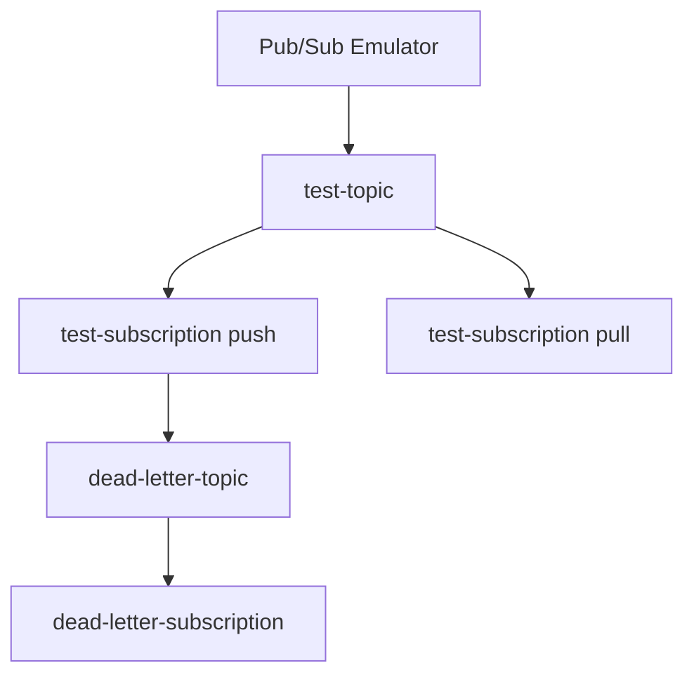

# MVFC.Aspire.Helpers.GcpPubSub

> 🇧🇷 [Leia em Português](README.pt-BR.md)

Helpers for integrating with Google Pub/Sub in .NET Aspire projects, including support for the emulator and administration interface (UI).

## Motivation

Working with Google Pub/Sub locally usually means:

- Spinning up an emulator container by hand.
- Remembering ports, project IDs and environment variables.
- Manually creating topics/subscriptions and DLQs.

With .NET Aspire you can define containers, but you still need to:

- Configure the emulator image and its ports.
- Keep emulator environment variables in sync across projects.
- Define topics/subscriptions/DLQs in a consistent way.

`MVFC.Aspire.Helpers.GcpPubSub` provides:

- `AddGcpPubSub(...)` to start the emulator.
- `WithPubSubConfigs(...)` to describe topics/subscriptions in code.
- `AddGcpPubSubUI(...)` to add a simple web UI.
- `WithReference(...)` to wire projects to the emulator and/or UI.

## Overview

This project facilitates the configuration and integration of Google Pub/Sub in distributed .NET Aspire applications, providing extension methods to:

- Add the Google Pub/Sub emulator.
- Configure topics and subscriptions automatically.
- Support push and pull subscriptions.
- Provide an administration interface (UI) for management.

## Pub/Sub emulator advantages

- Simulates message flow between services locally.
- Supports testing push and pull subscriptions without depending on Google Cloud infrastructure.
- Facilitates development and debugging of asynchronous integrations.

## Compatible Images

- **Emulator**:
  - `thekevjames/gcloud-pubsub-emulator`
  - `messagebird/gcloud-pubsub-emulator`
- **UI**:
  - `echocode/gcp-pubsub-emulator-ui`

## Project Structure

- [`MVFC.Aspire.Helpers.GcpPubSub`](MVFC.Aspire.Helpers.GcpPubSub.csproj): Helpers and extensions library for Pub/Sub.

## Features

- Adds the Google Pub/Sub emulator.
- Creates topics and subscriptions according to configuration.
- Supports push and pull subscriptions.
- Provides a Pub/Sub administration interface (UI).
- Extension methods to facilitate AppHost configuration.
- Dead Letter (DLQ) support.

## Installation

```sh
dotnet add package MVFC.Aspire.Helpers.GcpPubSub
```

## Quick Aspire usage (AppHost)

```csharp
using Aspire.Hosting;
using MVFC.Aspire.Helpers.GcpPubSub;

var builder = DistributedApplication.CreateBuilder(args);

var messageConfig = new MessageConfig(
    TopicName: "test-topic",
    SubscriptionName: "test-subscription",
    PushEndpoint: "/api/pub-sub-exit")
{
    DeadLetterTopic = "test-dead-letter-topic",
    MaxDeliveryAttempts = 5,
    AckDeadlineSeconds = 300,
};

var pubSubConfig = new PubSubConfig(
    projectId: "test-project",
    messageConfig: messageConfig);

var gcpPubSub = builder.AddGcpPubSub("gcp-pubsub")
    .WithPubSubConfigs([pubSubConfig])
    .WithWaitTimeout(secondsDelay: 5);

var ui = builder.AddGcpPubSubUI("pubsub-ui")
    .WithReference(gcpPubSub)
    .WaitFor(gcpPubSub);

builder.AddProject<Projects.MVFC_Aspire_Helpers_Playground_Api>("api-example")
       .WithReference(gcpPubSub)
       .WaitFor(gcpPubSub);

await builder.Build().RunAsync();
```

## Topics and subscriptions configuration

### `PubSubConfig`

| Parameter        | Type          | Default | Description                     |
|-----------------|---------------|---------|---------------------------------|
| `projectId`     | string        | —       | GCP project ID.                 |
| `messageConfig` | `MessageConfig` | —     | Message configuration.          |
| `secondsDelay`  | int           | `5`     | Startup delay in seconds.       |

### `MessageConfig`

| Parameter            | Type    | Default | Description                              |
|---------------------|---------|---------|------------------------------------------|
| `TopicName`         | string  | —       | Topic name.                              |
| `SubscriptionName`  | string? | `null`  | Subscription name.                       |
| `PushEndpoint`      | string? | `null`  | HTTP endpoint for push delivery.         |
| `DeadLetterTopic`   | string? | `null`  | Dead letter topic name (DLQ).            |
| `MaxDeliveryAttempts` | int?  | `null`  | Max attempts before sending to DLQ.      |
| `AckDeadlineSeconds` | int?   | `null`  | Ack deadline (seconds).                  |

**Note:** If `DeadLetterTopic` is provided, the subscription `{DeadLetterTopic}-subscription` will be created automatically.

## Ports

- **Emulator port:** `8681`
- **UI port:** `8680`

## Topics and subscriptions diagram


```mermaid
graph TD
A[Pub/Sub Emulator]
B[test-topic]
C[test-subscription push]
D[test-subscription pull]
E[dead-letter-topic]
F[dead-letter-subscription]

A --> B
B --> C
B --> D
C --> E
E --> F
```

## Public methods

- `AddGcpPubSub` – adds the emulator.  
- `AddGcpPubSubUI` – adds the Pub/Sub UI.  
- `WithPubSubConfigs` – configures projects, topics and subscriptions.  
- `WithWaitTimeout` – sets startup delay.  
- `WithReference` – wires projects to emulator/UI and sets env vars.

## Requirements

- .NET 9+
- Aspire.Hosting >= 9.5.0
- Google.Cloud.PubSub.V1 >= 3.29.0

## License

Apache-2.0
