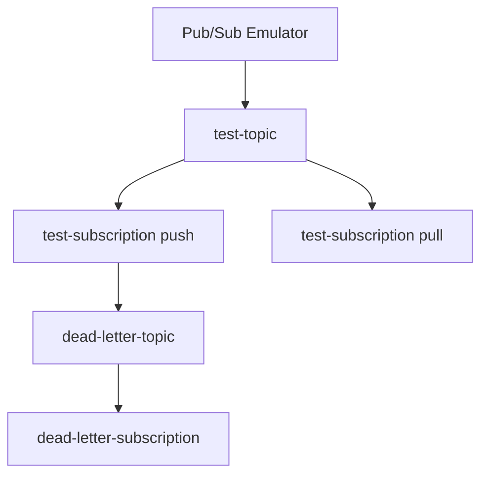

# MVFC.Aspire.Helpers.GcpPubSub

> 🇧🇷 [Leia em Português](README.pt-BR.md)

Helpers for integrating with Google Pub/Sub in .NET Aspire projects, including support for the emulator and administration interface (UI).

## Overview

This project facilitates the configuration and integration of Google Pub/Sub in distributed .NET Aspire applications, providing extension methods to:

- Add the Google Pub/Sub emulator.
- Configure topics and subscriptions automatically.
- Support push and pull subscriptions.
- Provide an administration interface (UI) for management.

## Pub/Sub Emulator Advantages

- Allows simulating the message flow between services locally.
- Supports testing push and pull subscriptions without depending on Google Cloud infrastructure.
- Facilitates the development and debugging of asynchronous integrations.

## Compatible Images:
 - **Emulator**:
   - `thekevjames/gcloud-pubsub-emulator`
   - `messagebird/gcloud-pubsub-emulator`
 - **UI**:
   - `echocode/gcp-pubsub-emulator-ui`

## Project Structure

- [`MVFC.Aspire.Helpers.GcpPubSub`](MVFC.Aspire.Helpers.GcpPubSub.csproj): Helpers and extensions library for Pub/Sub.

## Features

- Adds the Google Pub/Sub emulator using the official image.
- Creates topics and subscriptions according to configuration.
- Supports push and pull subscriptions.
- Provides a Pub/Sub administration interface (UI).
- Extension methods to facilitate AppHost configuration.
- Dead Letter (DLQ) support.

## Installation

Add the NuGet package to your AppHost project:

```sh
dotnet add package MVFC.Aspire.Helpers.GcpPubSub
```

## Usage Example in AppHost

```csharp
var builder = DistributedApplication.CreateBuilder(args);

var messageConfig = new MessageConfig(
    TopicName: "test-topic",
    SubscriptionName: "test-subscription",
    PushEndpoint: "/api/pub-sub-exit")
{
    DeadLetterTopic = "test-dead-letter-topic",
    MaxDeliveryAttempts = 5,
    AckDeadlineSeconds = 300,
};

var pubSubConfig = new PubSubConfig(
    projectId: "test-project",
    messageConfig: messageConfig);

var gcpPubSub = builder.AddGcpPubSub("gcp-pubsub")
    .WithPubSubConfigs([pubSubConfig])
    .WithWaitTimeout(secondsDelay: 5);

var ui = builder.AddGcpPubSubUI("pubsub-ui")
    .WithReference(gcpPubSub)
    .WaitFor(gcpPubSub);

builder.AddProject<Projects.MVFC_Aspire_Helpers_Playground_Api>("api-example")
       .WithReference(gcpPubSub)
       .WaitFor(gcpPubSub);

await builder.Build().RunAsync();
```

## Topics and Subscriptions Configuration

### PubSubConfig

| Parameter | Type | Default | Description |
|---|---|---|---|
| `projectId` | `string` | — | GCP project ID. |
| `messageConfig` | `MessageConfig` | — | Single message configuration (topic + subscription). |
| `secondsDelay` | `int` | `5` | Startup delay for resources in seconds. |

### MessageConfig

| Parameter | Type | Default | Description |
|---|---|---|---|
| `TopicName` | `string` | — | Message topic name. |
| `SubscriptionName` | `string?` | `null` | Topic subscription name. |
| `PushEndpoint` | `string?` | `null` | HTTP endpoint for push delivery. |
| `DeadLetterTopic` | `string?` | `null` | Dead letter topic name (DLQ). |
| `MaxDeliveryAttempts` | `int?` | `null` | Maximum attempts before sending to DLQ. |
| `AckDeadlineSeconds` | `int?` | `null` | Confirmation time (ack) in seconds. |

**Note:** If `DeadLetterTopic` is provided, the subscription `{DeadLetterTopic}-subscription` will be created automatically.

## Pub/Sub Port Details

- **Emulator Port:** `8681`
- **UI Port:** `8680`

## Topics and Subscriptions Structure


```mermaid
graph TD
A[Pub/Sub Emulator]
B[test-topic]
C[test-subscription push]
D[test-subscription pull]
E[dead-letter-topic]
F[dead-letter-subscription]

A --> B
B --> C
B --> D
C --> E
E --> F
```

## Public Methods

- **`AddGcpPubSub`**: Adds the Google Pub/Sub emulator to the distributed application.
- **`AddGcpPubSubUI`**: Adds the Pub/Sub administration interface (UI).
- **`WithPubSubConfigs`**: Configures emulator projects, topics, and subscriptions.
- **`WithWaitTimeout`**: Configures the resource startup delay.
- **`WithReference`** (on emulator or UI): Configures dependencies and environment variables in the project.

## Requirements
- .NET 9+
- Aspire.Hosting >= 9.5.0
- Google.Cloud.PubSub.V1 >= 3.29.0

## License
Apache-2.0
