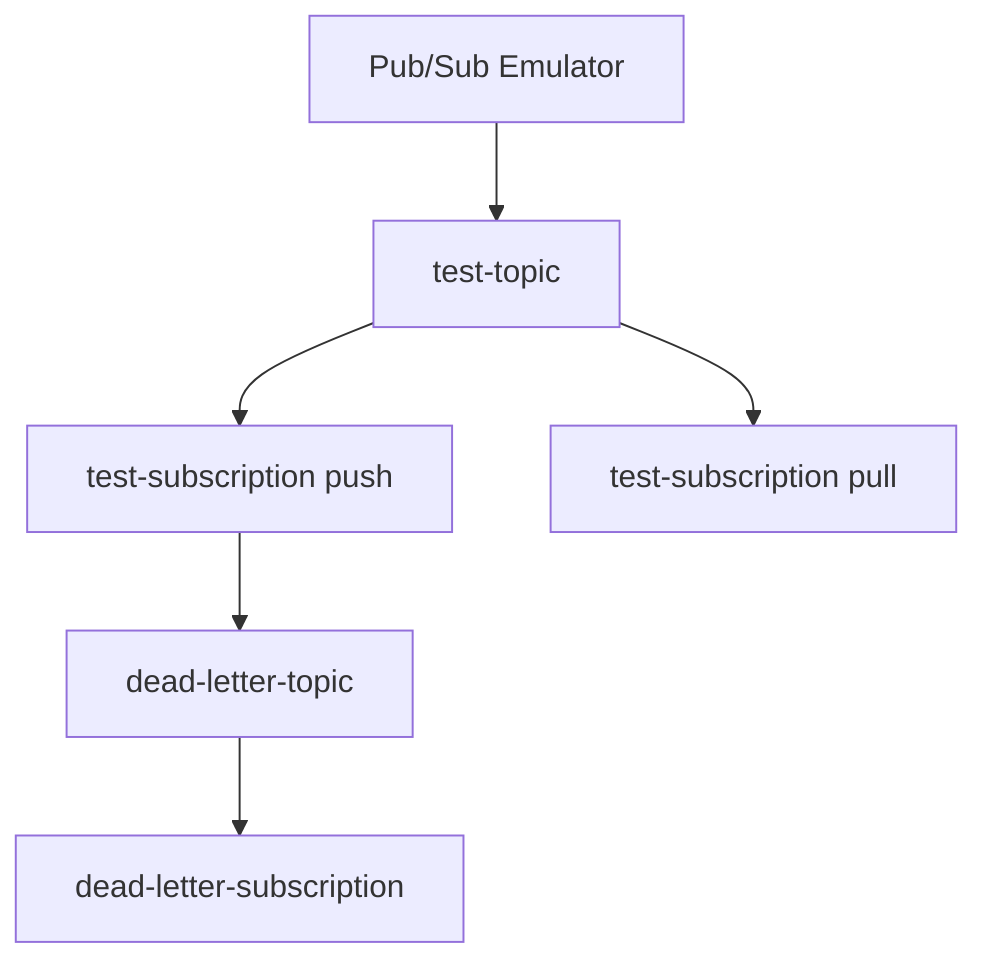

# MVFC.Aspire.Helpers.GcpPubSub

Helpers para integração com Google Pub/Sub em projetos .NET Aspire, incluindo suporte ao emulador e interface de administração (UI).

## Visão Geral

Este projeto facilita a configuração e integração do Google Pub/Sub em aplicações distribuídas .NET Aspire, fornecendo métodos de extensão para:

- Adicionar o emulador do Google Pub/Sub.
- Configurar tópicos e assinaturas automaticamente.
- Suporte a assinaturas do tipo push e pull.
- Disponibilizar interface de administração (UI) para gerenciamento.

## Vantagens do Emulador Pub/Sub

- Permite simular o fluxo de mensagens entre serviços localmente.
- Suporte a testes de assinaturas push e pull sem depender da infraestrutura do Google Cloud.
- Facilita o desenvolvimento e depuração de integrações assíncronas.

## Imagens compatíveis:
 - **Emulator**:
   - `thekevjames/gcloud-pubsub-emulator`
   - `messagebird/gcloud-pubsub-emulator`
 - **UI**:
   - `echocode/gcp-pubsub-emulator-ui`

## Estrutura do Projeto

- [`MVFC.Aspire.Helpers.GcpPubSub`](MVFC.Aspire.Helpers.GcpPubSub.csproj): Biblioteca de helpers e extensões para Pub/Sub.

## Funcionalidades

- Adiciona o emulador do Google Pub/Sub usando a imagem oficial.
- Cria tópicos e assinaturas conforme configuração.
- Suporte a assinaturas push e pull.
- Disponibiliza interface de administração (UI) para Pub/Sub.
- Métodos de extensão para facilitar a configuração no AppHost.
- Suporte a Dead Letter (DLQ).

## Instalação

Adicione o pacote NuGet ao seu projeto AppHost:

```sh
dotnet add package MVFC.Aspire.Helpers.GcpPubSub
```

## Exemplo de Uso no AppHost

```csharp
var builder = DistributedApplication.CreateBuilder(args);

var messageConfig = new MessageConfig(
    TopicName: "test-topic",
    SubscriptionName: "test-subscription",
    PushEndpoint: "/api/pub-sub-exit")
{
    DeadLetterTopic = "test-dead-letter-topic",
    MaxDeliveryAttempts = 5,
    AckDeadlineSeconds = 300,
};

var pubSubConfig = new PubSubConfig(
    projectId: "test-project",
    messageConfig: messageConfig);

var gcpPubSub = builder.AddGcpPubSub("gcp-pubsub")
    .WithPubSubConfigs([pubSubConfig])
    .WithWaitTimeout(secondsDelay: 5);

var ui = builder.AddGcpPubSubUI("pubsub-ui")
    .WithReference(gcpPubSub)
    .WaitFor(gcpPubSub);

builder.AddProject<Projects.MVFC_Aspire_Helpers_Playground_Api>("api-exemplo")
       .WithReference(gcpPubSub)
       .WaitFor(gcpPubSub);

await builder.Build().RunAsync();
```

## Configuração de Tópicos e Assinaturas

### PubSubConfig

| Parâmetro | Tipo | Padrão | Descrição |
|---|---|---|---|
| `projectId` | `string` | — | ID do projeto GCP. |
| `messageConfig` | `MessageConfig` | — | Configuração de mensagem única (tópico + assinatura). |
| `secondsDelay` | `int` | `5` | Delay em segundos para inicialização dos recursos. |

### MessageConfig

| Parâmetro | Tipo | Padrão | Descrição |
|---|---|---|---|
| `TopicName` | `string` | — | Nome do tópico de mensagens. |
| `SubscriptionName` | `string?` | `null` | Nome da assinatura do tópico. |
| `PushEndpoint` | `string?` | `null` | Endpoint HTTP para entrega via push. |
| `DeadLetterTopic` | `string?` | `null` | Nome do tópico de dead letter (DLQ). |
| `MaxDeliveryAttempts` | `int?` | `null` | Máximo de tentativas antes de enviar para DLQ. |
| `AckDeadlineSeconds` | `int?` | `null` | Tempo em segundos para confirmação (ack). |

**Observação:** Se `DeadLetterTopic` for informado, a subscription `{DeadLetterTopic}-subscription` será criada automaticamente.

## Detalhes de Porta do Pub/Sub

- **Porta do Emulador:** `8681`
- **Porta da UI:** `8680`

## Estrutura de Tópicos e Assinaturas


```mermaid
graph TD
A[Pub/Sub Emulator]
B[test-topic]
C[test-subscription push]
D[test-subscription pull]
E[dead-letter-topic]
F[dead-letter-subscription]

A --> B
B --> C
B --> D
C --> E
E --> F
```

## Métodos Públicos

- **`AddGcpPubSub`**: Adiciona o emulador do Google Pub/Sub à aplicação distribuída.
- **`AddGcpPubSubUI`**: Adiciona a interface de administração (UI) do Pub/Sub.
- **`WithPubSubConfigs`**: Configura os projetos, tópicos e assinaturas do emulador.
- **`WithWaitTimeout`**: Configura o delay de inicialização dos recursos.
- **`WithReference`** (no emulador ou UI): Configura dependências e variáveis de ambiente no projeto.

## Requisitos
- .NET 9+
- Aspire.Hosting >= 9.5.0
- Google.Cloud.PubSub.V1 >= 3.29.0

## Licença
Apache-2.0
