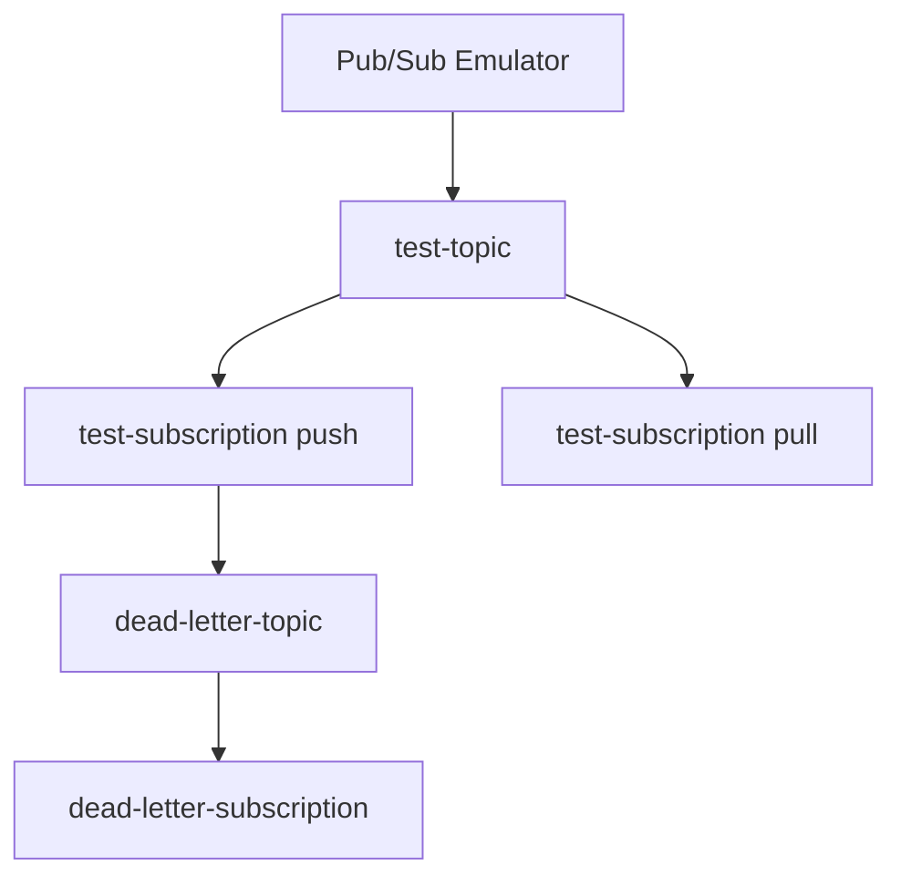

# MVFC.Aspire.Helpers.GcpPubSub

> 🇺🇸 [Read in English](README.md)

[](https://github.com/Marcus-V-Freitas/MVFC.Aspire.Helpers/actions/workflows/ci.yml)
[](https://github.com/Marcus-V-Freitas/MVFC.Aspire.Helpers)
[](../../LICENSE)


Helpers para integração com Google Pub/Sub em projetos .NET Aspire, incluindo suporte ao emulador e interface de administração (UI).

## Motivação

Trabalhar com Google Pub/Sub localmente normalmente significa:

- Subir um container de emulador na mão.
- Lembrar portas, project IDs e variáveis de ambiente.
- Criar manualmente tópicos, assinaturas e DLQs.

Com o .NET Aspire você pode definir containers, mas ainda precisa:

- Configurar a imagem do emulador e suas portas.
- Manter variáveis de ambiente do emulador em sincronia entre projetos.
- Definir tópicos/assinaturas/DLQs de forma consistente.

O `MVFC.Aspire.Helpers.GcpPubSub` fornece:

- `AddGcpPubSub(...)` para iniciar o emulador.
- `WithPubSubConfigs(...)` para descrever tópicos/assinaturas em código.
- `AddGcpPubSubUI(...)` para adicionar uma UI web simples.
- `WithReference(...)` para ligar projetos ao emulador e/ou UI.

## Visão Geral

Este projeto facilita a configuração e integração do Google Pub/Sub em aplicações distribuídas .NET Aspire, fornecendo métodos de extensão para:

- Adicionar o emulador do Google Pub/Sub.
- Configurar tópicos e assinaturas automaticamente.
- Suporte a assinaturas do tipo push e pull.
- Disponibilizar interface de administração (UI) para gerenciamento.

### Vantagens do Emulador Pub/Sub

- Permite simular o fluxo de mensagens entre serviços localmente.
- Suporte a testes de assinaturas push e pull sem depender da infraestrutura do Google Cloud.
- Facilita o desenvolvimento e depuração de integrações assíncronas.

## Imagens compatíveis

- **Emulator**:
  - `thekevjames/gcloud-pubsub-emulator`
  - `messagebird/gcloud-pubsub-emulator`
- **UI**:
  - `echocode/gcp-pubsub-emulator-ui`

## Estrutura do Projeto

- [`MVFC.Aspire.Helpers.GcpPubSub`](MVFC.Aspire.Helpers.GcpPubSub.csproj): Biblioteca de helpers e extensões para Pub/Sub.

## Funcionalidades

- Adiciona o emulador do Google Pub/Sub.
- Cria tópicos e assinaturas conforme configuração.
- Suporte a assinaturas push e pull.
- Disponibiliza interface de administração (UI) para Pub/Sub.
- Métodos de extensão para facilitar a configuração no AppHost.
- Suporte a Dead Letter (DLQ).

## Instalação

```sh
dotnet add package MVFC.Aspire.Helpers.GcpPubSub
```

## Uso rápido no Aspire (AppHost)

```csharp
using Aspire.Hosting;
using MVFC.Aspire.Helpers.GcpPubSub;

var builder = DistributedApplication.CreateBuilder(args);

var messageConfig = new MessageConfig(
    TopicName: "test-topic",
    SubscriptionName: "test-subscription",
    PushEndpoint: "/api/pub-sub-exit")
{
    DeadLetterTopic = "test-dead-letter-topic",
    MaxDeliveryAttempts = 5,
    AckDeadlineSeconds = 300,
};

var pubSubConfig = new PubSubConfig(
    projectId: "test-project",
    messageConfig: messageConfig);

var gcpPubSub = builder.AddGcpPubSub("gcp-pubsub")
    .WithPubSubConfigs([pubSubConfig])
    .WithWaitTimeout(secondsDelay: 5);

var ui = builder.AddGcpPubSubUI("pubsub-ui")
    .WithReference(gcpPubSub)
    .WaitFor(gcpPubSub);

builder.AddProject<Projects.MVFC_Aspire_Helpers_Playground_Api>("api-exemplo")
       .WithReference(gcpPubSub)
       .WaitFor(gcpPubSub);

await builder.Build().RunAsync();
```

## Configuração de Tópicos e Assinaturas

### `PubSubConfig`

| Parâmetro        | Tipo           | Padrão | Descrição                                  |
|-----------------|----------------|--------|--------------------------------------------|
| `projectId`     | string         | —      | ID do projeto GCP.                         |
| `messageConfig` | `MessageConfig`| —      | Configuração de mensagem (tópico + assinatura). |
| `secondsDelay`  | int            | `5`    | Delay em segundos para inicialização.      |

### `MessageConfig`

| Parâmetro             | Tipo    | Padrão | Descrição                                   |
|----------------------|---------|--------|---------------------------------------------|
| `TopicName`          | string  | —      | Nome do tópico.                             |
| `SubscriptionName`   | string? | `null` | Nome da assinatura.                         |
| `PushEndpoint`       | string? | `null` | Endpoint HTTP para entrega via push.        |
| `DeadLetterTopic`    | string? | `null` | Nome do tópico de dead letter (DLQ).        |
| `MaxDeliveryAttempts`| int?    | `null` | Máximo de tentativas antes de enviar à DLQ. |
| `AckDeadlineSeconds` | int?    | `null` | Tempo em segundos para confirmação (ack).   |

**Observação:** Se `DeadLetterTopic` for informado, a subscription `{DeadLetterTopic}-subscription` será criada automaticamente.

## Portas

- **Porta do Emulador:** `8681`
- **Porta da UI:** `8680`

## Estrutura de Tópicos e Assinaturas



## Métodos Públicos

- `AddGcpPubSub` – adiciona o emulador.
- `AddGcpPubSubUI` – adiciona a UI do Pub/Sub.
- `WithPubSubConfigs` – configura projetos, tópicos e assinaturas.
- `WithWaitTimeout` – define o delay de inicialização.
- `WithReference` – liga projetos ao emulador/UI e configura variáveis de ambiente.

## Requisitos

- .NET 9+
- Aspire.Hosting >= 9.5.0
- Google.Cloud.PubSub.V1 >= 3.29.0

## Licença

Apache-2.0
