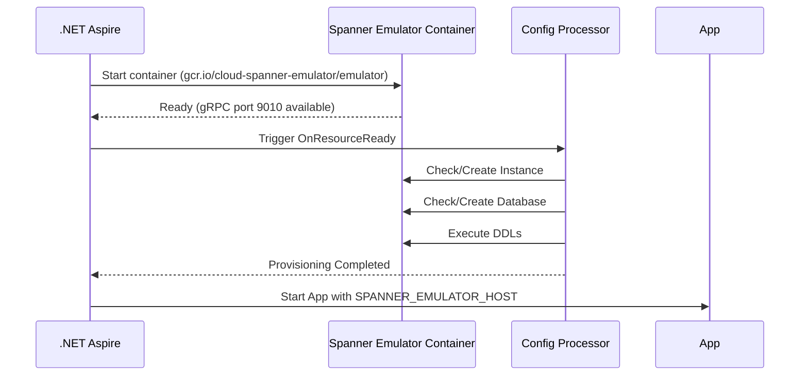

# MVFC.Aspire.Helpers.GcpSpanner

> 🇧🇷 [Leia em Português](README.pt-BR.md)

[](https://github.com/Marcus-V-Freitas/MVFC.Aspire.Helpers/actions/workflows/ci.yml)
[](https://codecov.io/gh/Marcus-V-Freitas/MVFC.Aspire.Helpers)
[](../../LICENSE)


Helpers for integrating with Google Cloud Spanner in .NET Aspire projects, including support for the emulator.

## Motivation

Working with Google Cloud Spanner locally usually means:

- Spinning up an emulator container by hand.
- Remembering ports, project IDs, instances, databases, and environment variables.
- Manually creating instances and databases, and running DDL scripts.

With .NET Aspire you can define containers, but you still need to:

- Configure the emulator image and its ports.
- Keep emulator environment variables in sync across projects.
- Define instances/databases in a consistent way before the application runs.

`MVFC.Aspire.Helpers.GcpSpanner` provides:

- `AddGcpSpanner(...)` to start the emulator.
- `WithSpannerConfigs(...)` to describe instances, databases, and execute DDLs in code.
- `WithReference(...)` to wire projects to the emulator and inject connection configurations automatically.

## Overview

This project facilitates the configuration and integration of Google Cloud Spanner in distributed .NET Aspire applications, providing extension methods to:

- Add the Google Cloud Spanner emulator.
- Configure instances and databases automatically upon startup.
- Execute DDL statements right after database creation.
- Properly inject the emulator host connection string for automatic detection by Spanner clients.

## Spanner emulator advantages

- Simulates Spanner databases locally for development and testing.
- Allows testing schema changes and query executions without depending on Google Cloud infrastructure.
- Facilitates development of robust data storage implementations.

## Compatible Images

- **Emulator**:
  - `gcr.io/cloud-spanner-emulator/emulator` (Default in Aspire helper)

## Project Structure

- [`MVFC.Aspire.Helpers.GcpSpanner`](MVFC.Aspire.Helpers.GcpSpanner.csproj): Helpers and extensions library for Spanner.

## Features

- Adds the Google Cloud Spanner emulator.
- Creates instances and databases according to configuration.
- Executes custom DDL statements upon provisioning.
- Native gRPC port health checks ensure the emulator is fully ready before projects start consuming it.
- Extension methods to facilitate AppHost configuration.

## Installation

```sh
dotnet add package MVFC.Aspire.Helpers.GcpSpanner
```

## Quick Aspire usage (AppHost)

```csharp
using Aspire.Hosting;
using MVFC.Aspire.Helpers.GcpSpanner;
using MVFC.Aspire.Helpers.GcpSpanner.Models;

var builder = DistributedApplication.CreateBuilder(args);

var spannerConfig = new SpannerConfig(
    ProjectId: "test-project",
    InstanceId: "dev-instance",
    DatabaseId: "dev-db",
    DdlStatements:
    [
        """
        CREATE TABLE Users (
            UserId STRING(36) NOT NULL,
            Name STRING(256) NOT NULL,
            CreatedAt TIMESTAMP NOT NULL OPTIONS (allow_commit_timestamp=true)
        ) PRIMARY KEY (UserId)
        """
    ]);

var spanner = builder.AddGcpSpanner("gcp-spanner")
                     .WithSpannerConfigs(spannerConfig)
                     .WithWaitTimeout(30);

builder.AddProject<Projects.MVFC_Aspire_Helpers_Playground_Api>("api-example")
       .WithReference(spanner)
       .WaitFor(spanner);

await builder.Build().RunAsync();
```

## Emulated Resources Configuration

### `SpannerConfig`

| Parameter       | Type                    | Default | Description                                   |
|-----------------|-------------------------|---------|-----------------------------------------------|
| `ProjectId`     | string                  | —       | GCP project ID.                               |
| `InstanceId`    | string                  | —       | Instance ID.                                  |
| `DatabaseId`    | string                  | —       | Database ID.                                  |
| `DdlStatements` | `IReadOnlyList<string>?`| `null`  | Check DDL statements to run after DB creation.|

## Ports

- **gRPC Port:** `9010`

## Provisioning diagram



## Public methods

- `AddGcpSpanner` – adds the emulator container.
- `WithSpannerConfigs` – configures instances, databases, and DDL scripts.
- `WithWaitTimeout` – sets emulator startup delay timeout.
- `WithReference` – wires projects to the emulator and sets the `SPANNER_EMULATOR_HOST` environment variable automatically.

## Requirements

- .NET 9+
- Aspire.Hosting >= 9.5.0
- Google.Cloud.Spanner.Data >= 5.6.0 (or Google.Cloud.Spanner.V1)

## License

Apache-2.0
