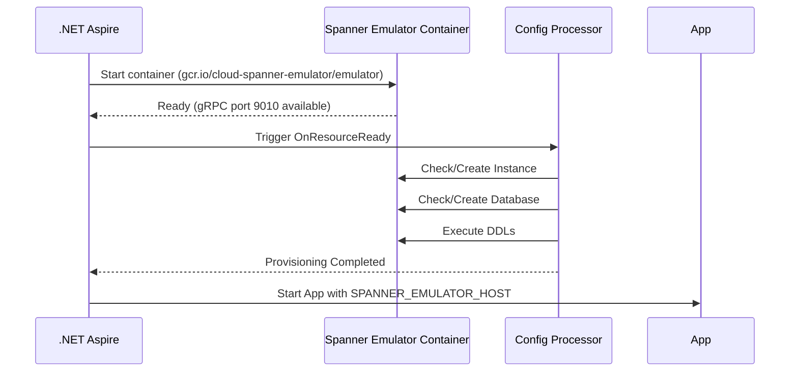

# MVFC.Aspire.Helpers.GcpSpanner

> 🇺🇸 [Read in English](README.md)

[](https://github.com/Marcus-V-Freitas/MVFC.Aspire.Helpers/actions/workflows/ci.yml)
[](https://codecov.io/gh/Marcus-V-Freitas/MVFC.Aspire.Helpers)
[](../../LICENSE)


Helpers para integração com Google Cloud Spanner em projetos .NET Aspire, incluindo suporte ao emulador.

## Motivação

Trabalhar com Google Cloud Spanner localmente normalmente significa:

- Subir um container de emulador na mão.
- Lembrar portas, project IDs, instâncias, bancos de dados e variáveis de ambiente.
- Criar manualmente instâncias e bancos de dados, e executar scripts DDL.

Com o .NET Aspire você pode definir containers, mas ainda precisa:

- Configurar a imagem do emulador e suas portas.
- Manter variáveis de ambiente do emulador em sincronia entre projetos.
- Definir instâncias/databases de forma consistente antes da aplicação rodar.

O `MVFC.Aspire.Helpers.GcpSpanner` fornece:

- `AddGcpSpanner(...)` para iniciar o emulador.
- `WithSpannerConfigs(...)` para descrever instâncias, bancos de dados e executar DDLs via código.
- `WithReference(...)` para ligar projetos ao emulador e injetar configurações de conexão automaticamente.

## Visão Geral

Este projeto facilita a configuração e integração do Google Cloud Spanner em aplicações distribuídas .NET Aspire, fornecendo métodos de extensão para:

- Adicionar o emulador do Google Cloud Spanner.
- Configurar instâncias e bancos de dados automaticamente na inicialização.
- Executar instruções DDL logo após a criação do banco de dados.
- Injetar adequadamente a connection string do host do emulador para detecção automática pelos clientes do Spanner.

## Vantagens do Emulador Spanner

- Simula bancos de dados Spanner localmente para desenvolvimento e testes.
- Permite testar mudanças de esquema e execução de consultas sem depender da infraestrutura do Google Cloud.
- Facilita o desenvolvimento de implementações robustas de armazenamento de dados.

## Imagens compatíveis

- **Emulator**:
  - `gcr.io/cloud-spanner-emulator/emulator` (Padrão no helper do Aspire)

## Estrutura do Projeto

- [`MVFC.Aspire.Helpers.GcpSpanner`](MVFC.Aspire.Helpers.GcpSpanner.csproj): Biblioteca de helpers e extensões para Spanner.

## Funcionalidades

- Adiciona o emulador do Google Cloud Spanner.
- Cria instâncias e bancos de dados conforme configuração.
- Executa instruções DDL personalizadas durante o provisionamento.
- Validações de integridade nativas via gRPC na porta garantem que o emulador esteja totalmente pronto antes dos projetos o consumirem.
- Métodos de extensão para facilitar a configuração no AppHost.

## Instalação

```sh
dotnet add package MVFC.Aspire.Helpers.GcpSpanner
```

## Uso rápido no Aspire (AppHost)

```csharp
using Aspire.Hosting;
using MVFC.Aspire.Helpers.GcpSpanner;
using MVFC.Aspire.Helpers.GcpSpanner.Models;

var builder = DistributedApplication.CreateBuilder(args);

var spannerConfig = new SpannerConfig(
    ProjectId: "test-project",
    InstanceId: "dev-instance",
    DatabaseId: "dev-db",
    DdlStatements:
    [
        """
        CREATE TABLE Users (
            UserId STRING(36) NOT NULL,
            Name STRING(256) NOT NULL,
            CreatedAt TIMESTAMP NOT NULL OPTIONS (allow_commit_timestamp=true)
        ) PRIMARY KEY (UserId)
        """
    ]);

var spanner = builder.AddGcpSpanner("gcp-spanner")
                     .WithSpannerConfigs(spannerConfig)
                     .WithWaitTimeout(30);

builder.AddProject<Projects.MVFC_Aspire_Helpers_Playground_Api>("api-example")
       .WithReference(spanner)
       .WaitFor(spanner);

await builder.Build().RunAsync();
```

## Configuração de Recursos Emulados

### `SpannerConfig`

| Parâmetro       | Tipo                    | Padrão  | Descrição                                         |
|-----------------|-------------------------|---------|---------------------------------------------------|
| `ProjectId`     | string                  | —       | ID do projeto GCP.                                |
| `InstanceId`    | string                  | —       | ID da instância.                                  |
| `DatabaseId`    | string                  | —       | ID do banco de dados.                             |
| `DdlStatements` | `IReadOnlyList<string>?`| `null`  | Instruções DDL a executar após criação do DB.     |

## Portas

- **Porta gRPC:** `9010`

## Diagrama de provisionamento



## Métodos Públicos

- `AddGcpSpanner` – adiciona o container do emulador.
- `WithSpannerConfigs` – configura instâncias, bancos de dados e scripts DDL.
- `WithWaitTimeout` – define timeout do delay de inicialização do emulador.
- `WithReference` – liga projetos ao emulador e configura a variável de ambiente `SPANNER_EMULATOR_HOST` automaticamente.

## Requisitos

- .NET 9+
- Aspire.Hosting >= 9.5.0
- Google.Cloud.Spanner.Data >= 5.6.0 (ou Google.Cloud.Spanner.V1)

## Licença

Apache-2.0
