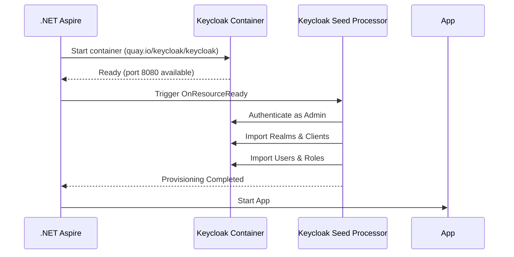

# MVFC.Aspire.Helpers.Keycloak

> 🇧🇷 [Leia em Português](README.pt-BR.md)

[](https://github.com/Marcus-V-Freitas/MVFC.Aspire.Helpers/actions/workflows/ci.yml)
[](https://codecov.io/gh/Marcus-V-Freitas/MVFC.Aspire.Helpers)
[](../../LICENSE)


This package provides extension methods for **.NET Aspire**, simplifying the integration, configuration, and initialization of a **Keycloak** server to manage local environment identity and access.

With it, you can not only initialize an official Keycloak container but also inject configurations (like `BaseUrl`, `Realm`, `ClientId`, etc.) and import custom realms (via JSON seeds) at development time.

## Motivation

Keycloak is powerful, but local setup is often painful:

- Large docker commands with many environment variables and import flags.
- Manually importing realms, clients and users from JSON files.
- Repeating the same setup for every project or demo.

With .NET Aspire you can define a Keycloak container, but you still need to:

- Track admin credentials, ports and volumes.
- Decide how to seed realms/clients/users in a repeatable way.
- Make your applications wait for Keycloak to be ready.

`MVFC.Aspire.Helpers.Keycloak` turns this into a small, opinionated API:

- `AddKeycloak(...)` runs Keycloak with sensible defaults for dev.
- `WithAdminCredentials(...)`, `WithDataVolume(...)` and `WithSeeds(...)` centralize Keycloak‑specific concerns.
- `project.WithReference(keycloak, ...)` wires your projects to Keycloak with the correct dependencies and configuration.

## Features and Capabilities

- **Embedded Server:** Starts an official Keycloak container (currently `quay.io/keycloak/keycloak:26.1.1`).  
- **Default Authentication:** Optional configuration with a pre-defined `ClientId` and seeds for developers.  
- **Customizable Port:** Fixed or dynamic port mapping by Aspire.  
- **Transparent Injection:** Adds authentication endpoints to `.WithReference()` projects, configuring URLs, realms, and ClientIds as environment variables.  
- **Persistent Volume:** Optionally saves state and internal databases.  
- **Dynamic Realm Import (Seeds):** Bootstrap your development environment by populating realms, clients, roles, and users via code configuration.

## Installation

Add the package to the main AppHost project in your .NET Aspire solution:

```sh
dotnet add package MVFC.Aspire.Helpers.Keycloak
```

## Quick Aspire usage (AppHost)

```csharp
using Aspire.Hosting;
using MVFC.Aspire.Helpers.Keycloak;

var builder = DistributedApplication.CreateBuilder(args);

// Adding a basic Keycloak container
var keycloak = builder.AddKeycloak("keycloak", port: 9000)
    // Example: automatically creating a Realm with clients and roles via code
    .WithSeeds(new()
    {
        Realm = "my-app-realm",
        Clients = [
            new() { ClientId = "my-api", Secret = "api-secret-1234", DisableAuth = true }
        ],
        Roles = ["Admin", "User"],
        Users = [
            new() { Username = "admin", Password = "123", Roles = ["Admin", "User"] }
        ]
    });

var api = builder.AddProject<Projects.My_Api>("api")
    .WithReference(keycloak, realmName: "my-app-realm", clientId: "my-api", clientSecret: "api-secret-1234")
    .WaitFor(keycloak);

builder.Build().Run();
```

## Using the injected configuration in the API

By default, when using `.WithReference(keycloak)`, Aspire injects the following configuration keys into your `IConfiguration`:

| Configuration Key     | Description                                            | Example                 |
|-----------------------|--------------------------------------------------------|-------------------------|
| `Keycloak:BaseUrl`    | Full URL to access the Keycloak container.            | `http://localhost:9000` |
| `Keycloak:Realm`      | Realm name propagated from the AppHost.               | `my-app-realm`          |
| `Keycloak:ClientId`   | OAuth/OpenID client ID.                                | `my-api`                |
| `Keycloak:ClientSecret` | (Optional) Secret associated with the client.       | `api-secret-1234`       |

Example in your API:

```csharp
var baseUrl  = builder.Configuration["Keycloak:BaseUrl"];
var realm    = builder.Configuration["Keycloak:Realm"];
var clientId = builder.Configuration["Keycloak:ClientId"];

builder.Services.AddAuthentication(JwtBearerDefaults.AuthenticationScheme)
    .AddJwtBearer(options =>
    {
        options.RequireHttpsMetadata = false; // dev
        options.Audience = clientId;
        options.MetadataAddress = $"{baseUrl}/realms/{realm}/.well-known/openid-configuration";
        options.TokenValidationParameters = new TokenValidationParameters
        {
            ValidIssuer = $"{baseUrl}/realms/{realm}",
            ValidateIssuer = true,
            ValidateAudience = true,
            ValidAudience = clientId
        };
    });

builder.Services.AddAuthorization();
```

## Provisioning diagram



## `AddKeycloak()` options

| Parameter   | Type     | Description                                                                 | Default      |
|------------|----------|-----------------------------------------------------------------------------|--------------|
| `name`     | string   | Resource name in the Aspire framework.                                     | `"keycloak"` |
| `userName` | string   | Keycloak master admin user.                                                | `admin`      |
| `password` | string   | Keycloak master admin password.                                            | `admin`      |
| `port`     | int?     | Fixed port exposed to localhost (e.g. 9000). If null, Aspire resolves it. | `null`       |
| `dataBound`| bool     | If true, applies `.WithDataBindMount()` to create a state volume.         | `false`      |

## Additional extensions

- `.WithSeeds(KeycloakRealmSeed)` – builds and imports a realm JSON into `/opt/keycloak/data/import/`.  
- `.WithRealmImport(importPath)` – loads static realm JSONs from a folder and imports into the container.

## License

Apache-2.0
