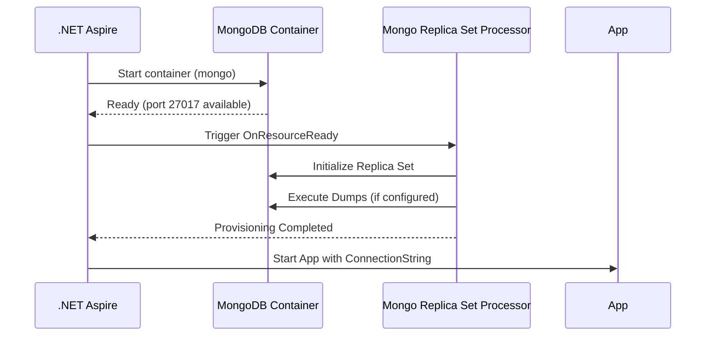

# MVFC.Aspire.Helpers.Mongo

> 🇧🇷 [Leia em Português](README.pt-BR.md)

[](https://github.com/Marcus-V-Freitas/MVFC.Aspire.Helpers/actions/workflows/ci.yml)
[](https://codecov.io/gh/Marcus-V-Freitas/MVFC.Aspire.Helpers)
[](../../LICENSE)


Helpers for integrating with MongoDB in .NET Aspire projects, including support for Replica Sets and automatic initialization.

## Motivation

Setting up MongoDB locally is easy; setting up a **Replica Set with realistic behavior and seed data** is not.

Typical pain points in local dev:

- Creating and initializing the Replica Set using custom scripts.
- Remembering which ports are exposed and how to build the connection string.
- Manually running `mongorestore` or ad‑hoc scripts every time you start the environment.

With .NET Aspire you can already model a MongoDB container, but you still have to wire:

- Replica Set arguments and init scripts.
- Data volumes for persistence between runs.
- Connection string configuration for your projects.
- Any logic that runs once to populate sample data.

`MVFC.Aspire.Helpers.Mongo` wraps these concerns into a focused API:

- `AddMongoReplicaSet(...)` to get a ready‑to‑use Replica Set container.
- Fluent methods like `WithDumps(...)` and `WithDataVolume(...)`.
- `project.WithReference(mongo)` to inject the connection string and trigger dumps automatically when the resource is ready.

## Overview

This project facilitates the configuration and integration of MongoDB in distributed .NET Aspire applications, providing extension methods to:

- Add a MongoDB container configured as a Replica Set.
- Automatically initialize the Replica Set via script.
- Populate the database with sample data using custom dumps.

### Why use a Replica Set?

MongoDB only allows multi‑document transactions when configured as a Replica Set, even in local environments.

By using the helper with Replica Set, you can:

- **Simulate local transactions:**  
  Test transactional operations (commit/rollback) across multiple documents and collections, matching your production behavior.
- **Prepare for high availability:**  
  A Replica Set is the foundation for advanced MongoDB features like failover and redundancy; even locally, it helps you run closer to a real‑world setup.

## Project structure

- [`MVFC.Aspire.Helpers.Mongo`](MVFC.Aspire.Helpers.Mongo.csproj): Helpers and extensions library for MongoDB.

## Features

- Adds a MongoDB container configured as a Replica Set.
- Automatic Replica Set initialization.
- Support for populating collections with sample data.
- Extension methods to simplify AppHost configuration.

### Compatible Docker images

- `mongo`

## Installation

Add the NuGet package to your AppHost project:

```sh
dotnet add package MVFC.Aspire.Helpers.Mongo
```

## Quick Aspire usage (AppHost)

Minimal example in your `AppHost` using Bogus to seed test data:

```csharp
using Aspire.Hosting;
using Bogus;
using MVFC.Aspire.Helpers.Mongo;

var builder = DistributedApplication.CreateBuilder(args);

IReadOnlyCollection<IMongoClassDump> dumps =
[
    new MongoClassDump<TestDatabase>(
        DatabaseName: "TestDatabase",
        CollectionName: "TestCollection",
        Quantity: 100,
        Faker: new Faker<TestDatabase>()
            .CustomInstantiator(f => new TestDatabase(
                f.Person.FirstName,
                f.Person.Cpf())))
];

var mongo = builder.AddMongoReplicaSet("mongo")
    .WithDumps(dumps)
    .WithDataVolume("mongo-data");

builder.AddProject<Projects.MVFC_Aspire_Helpers_Playground_Api>("api-example")
       .WithReference(mongo)
       .WaitFor(mongo);

await builder.Build().RunAsync();
```

What this setup gives you:

- A MongoDB Replica Set running in Docker.
- A persistent Docker volume `mongo-data` (if configured).
- Database/collection automatically populated with fake data at startup.
- A connection string injected into the project configuration.

## Provisioning diagram



## Fluent methods

| Method                            | Description                                       |
|-----------------------------------|---------------------------------------------------|
| `WithDockerImage(image, tag)`     | Overrides the Docker image used.                  |
| `WithDumps(dumps)`                | Configures data dumps to execute on initialization. |
| `WithDataVolume(volumeName)`      | Enables persistence with a Docker volume.         |

## Populating sample data

`MongoClassDump<T>` is a class used to facilitate the automatic insertion of sample data into MongoDB collections during environment initialization. It acts as a **template** to populate the database with fake documents, useful for local testing and development.

**Main parameters:**

- `DatabaseName`: Database name.
- `CollectionName`: Collection name.
- `Quantity`: Number of documents.
- `Faker`: Data generator (for example, using the **Bogus** library with the `Faker` class).

## Configuration options

### Optional parameters

- **`volumeName`** (optional):  
  Local Docker volume name used to persist data between debugging sessions.  
  Default: `null` (volume discarded between executions).

- **`connectionStringSection`** (optional):  
  Path to the configuration section containing the MongoDB connection string.  
  Default: `"ConnectionStrings:mongo"`.

Each `:` indicates a level/section within the `appsettings.json` file:

```json
{
  "ConnectionStrings": {
    "mongo": "mongodb://localhost:27017/"
  }
}
```

### Visualization and ports

- **Port used:** `27017` (MongoDB default).
- **View databases:**  
  Connect via a MongoDB client (MongoDB Compass, Robo 3T, `mongosh`, etc.) using:

  `mongodb://localhost:27017/`

## Requirements

- .NET 9+
- Aspire.Hosting >= 9.5.0
- Bogus >= 35.6.0
- MongoDB.Driver >= 3.5.0

## License

Apache-2.0
