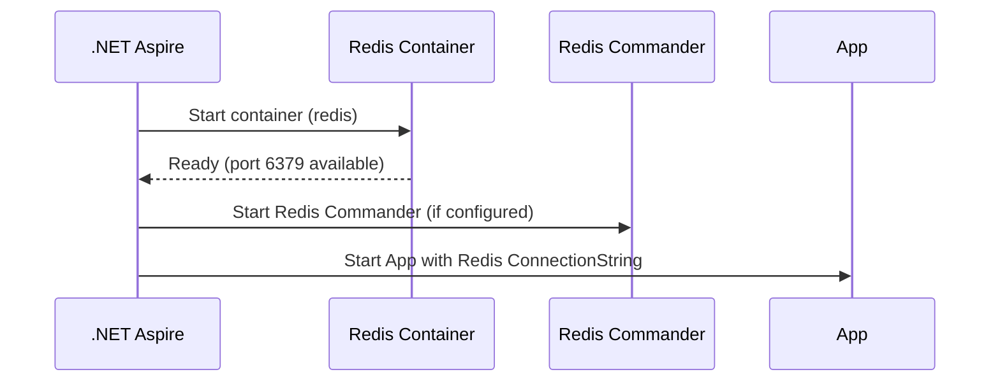

# MVFC.Aspire.Helpers.Redis

> 🇧🇷 [Leia em Português](README.pt-BR.md)

[](https://github.com/Marcus-V-Freitas/MVFC.Aspire.Helpers/actions/workflows/ci.yml)
[](https://codecov.io/gh/Marcus-V-Freitas/MVFC.Aspire.Helpers)
[](../../LICENSE)


Helper for integrating with Redis in .NET Aspire projects, including distributed caching and Redis Commander UI.

## Motivation

For local dev, Redis is often set up via an ad‑hoc container:

- No clear place to centralize password configuration.
- No built‑in UI to inspect keys/values.
- No consistent way to mount volumes and preserve state.

With .NET Aspire you can start a Redis container, but you still need to:

- Decide how to expose Redis to your projects.
- Configure Redis Commander (or similar) manually.
- Keep connection strings aligned across services.

`MVFC.Aspire.Helpers.Redis` addresses this by:

- `AddRedis(...)` to provision Redis.
- `WithPassword(...)`, `WithCommander(...)`, `WithDataVolume(...)` to cover common setups.
- `project.WithReference(redis)` to pass the Redis connection string via configuration.

## Overview

This project provides extension methods to facilitate integration with Redis in .NET Aspire projects, including distributed caching and Redis Commander UI.

## Project Structure

- [`MVFC.Aspire.Helpers.Redis`](MVFC.Aspire.Helpers.Redis.csproj): Helpers and extensions library for Redis.

## Features

- Adds a configured Redis container.
- Support for Redis Commander UI.
- Support for data persistence via Docker volume (AOF enabled).
- Support for password.

## Compatible Images

- `redis`
- `rediscommander/redis-commander` (UI)

## Installation

```sh
dotnet add package MVFC.Aspire.Helpers.Redis
```

## Quick Aspire usage (AppHost)

```csharp
using Aspire.Hosting;
using MVFC.Aspire.Helpers.Redis;

var builder = DistributedApplication.CreateBuilder(args);

var redis = builder.AddRedis("redis")
    .WithPassword("my-password")
    .WithCommander()
    .WithDataVolume("redis-data");

builder.AddProject<Projects.MVFC_Aspire_Helpers_Playground_Api>("api-example")
       .WithReference(redis)
       .WaitFor(redis);

await builder.Build().RunAsync();
```

## Provisioning diagram



## Fluent methods

| Method                         | Description                                            |
|-------------------------------|--------------------------------------------------------|
| `WithDockerImage(image, tag)` | Overrides the Docker image used.                       |
| `WithPassword(password)`      | Defines the Redis password.                            |
| `WithCommander(port?)`        | Adds the Redis Commander UI.                           |
| `WithDataVolume(volumeName)`  | Enables persistence with Docker volume (AOF).          |

## `AddRedis` parameters

- `name`: Redis resource name.  
- `port` *(optional)*: Redis port (default `6379`).

## Other optional parameters

- **`connectionStringSection`** (optional):  
  Path to the configuration section containing the Redis connection string.  
  Default: `"ConnectionStrings:redis"`.

```json
{
  "ConnectionStrings": {
    "redis": "localhost:6379"
  }
}
```

## Port details

- **Redis port**: defined via `port` (default `6379`).  
- **Redis Commander port**: random by default; can be defined via `commanderPort` in `WithCommander`.

## Requirements

- .NET 9+
- Aspire.Hosting >= 9.5.0

## License

Apache-2.0
