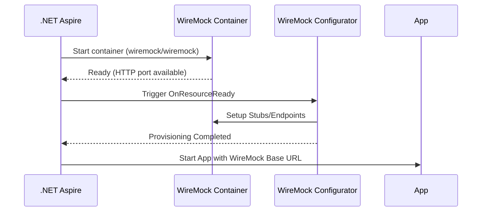

# MVFC.Aspire.Helpers.WireMock

> 🇧🇷 [Leia em Português](README.pt-BR.md)

[](https://github.com/Marcus-V-Freitas/MVFC.Aspire.Helpers/actions/workflows/ci.yml)
[](https://codecov.io/gh/Marcus-V-Freitas/MVFC.Aspire.Helpers)
[](../../LICENSE)


Helpers for integrating WireMock.Net in .NET Aspire projects, facilitating API mocking for development, testing, and integration.

## Motivation

Mocking HTTP APIs locally often involves:

- Running WireMock.Net manually or as a separate console app.
- Scattering mock configuration across JSON files or test projects.
- No clear place to manage the mock lifecycle with the rest of your topology.

With .NET Aspire you can orchestrate resources, but you still need to:

- Start/stop the mock along with your app.
- Configure endpoints, methods and auth consistently.
- Wire other projects to talk to the mock.

`MVFC.Aspire.Helpers.WireMock` addresses this by:

- `AddWireMock(...)` to run WireMock.Net as an embedded server in Aspire.
- A fluent API to configure endpoints, auth, headers, body types and responses.
- `WithReference(...)` to make projects wait for the mock and consume its URL.

## Overview

This project allows easily adding a WireMock.Net server as a managed resource in distributed .NET Aspire applications. It simplifies provisioning, lifecycle management, and exposing mocked HTTP endpoints, while also allowing custom configuration and publishing state/log events.

### WireMock helper advantages

- Simulates external/local APIs for testing and integration.
- Allows defining endpoints, methods, authentication, and custom responses.
- Facilitates decoupled development and automated testing.
- Manages the WireMock resource lifecycle within the Aspire environment.

## Project Structure

- [`MVFC.Aspire.Helpers.WireMock`](MVFC.Aspire.Helpers.WireMock.csproj): Helpers and extensions library for WireMock.Net.

## Features

- Adds a WireMock resource to the Aspire application with managed lifecycle.
- Allows detailed configuration of mocked endpoints.
- Support for authentication (Bearer, custom headers).
- Configuration of body types, headers, status codes, and errors.
- Publishes resource state and log events.

## Compatible Images

- Uses WireMock.Net as an embedded server (no Docker image required).

## Installation

```sh
dotnet add package MVFC.Aspire.Helpers.WireMock
```

## Endpoint configuration examples

You can configure mocked endpoints with different HTTP methods, body types, authentication, headers, and custom responses.

- **Bearer authentication:**

```csharp
server.Endpoint("/api/secure")
       .RequireBearer("mytoken", "Unauthorized", BodyType.String)
       .OnGet(() => ("Secret Data", HttpStatusCode.OK, BodyType.String));
```

- **Custom headers:**

```csharp
server.Endpoint("/api/headers")
      .WithResponseHeaders(new() { { "X-Test", ["v1", "v2"] } })
      .OnGet(() => ("Headers OK", HttpStatusCode.OK, BodyType.String));
```

Supported body types include `String`, `Json`, `Bytes`, `FormUrlEncoded`, etc.

## Provisioning diagram



## Ports and access

- **Port**: defined via `port` parameter (e.g. `8080`).  
- Access: `http://localhost:<port>/api/...`.

## Public methods

- `AddWireMock` – adds the WireMock resource to the distributed application and lets you configure endpoints.

```csharp
var wireMock = builder.AddWireMock("wireMock", port: 8080, configure: ...);
```

## Complete Aspire usage example (AppHost)

```csharp
using Aspire.Hosting;
using MVFC.Aspire.Helpers.WireMock;

var builder = DistributedApplication.CreateBuilder(args);

var wireMock = builder.AddWireMock("wireMock", port: 8080, configure: (server) =>
{
    server.Endpoint("/api/echo")
          .WithDefaultBodyType(BodyType.String)
          .OnPost<string, string>(body => ($"Echo: {body}", HttpStatusCode.Created, null));

    server.Endpoint("/api/test")
          .WithDefaultBodyType(BodyType.String)
          .OnGet<string>(() => ("Aspire GET OK", HttpStatusCode.OK, null));

    server.Endpoint("/api/secure")
           .RequireBearer("mytoken", "Unauthorized", BodyType.String)
           .OnGet(() => ("Secret Data", HttpStatusCode.OK, BodyType.String));

    server.Endpoint("/api/put")
           .WithDefaultBodyType(BodyType.String)
           .OnPut<string, string>(req => ($"Echo: {req}", HttpStatusCode.Accepted, BodyType.String));

    server.Endpoint("/api/customauth")
        .WithDefaultErrorStatusCode(HttpStatusCode.Forbidden)
        .RequireCustomAuth(req => (req.Headers!.ContainsKey("X-Test"), "Forbidden", BodyType.String))
        .OnGet(() => ("Authorized", HttpStatusCode.OK, BodyType.String));

    server.Endpoint("/api/headers")
        .WithResponseHeaders(new() { { "X-Test", ["v1", "v2"] } })
        .WithResponseHeader("X-Other", "v3")
        .OnGet(() => ("Headers OK", HttpStatusCode.OK, BodyType.String));

    server.Endpoint("/api/error")
        .WithRequestBodyType(BodyType.String)
        .WithDefaultErrorStatusCode((HttpStatusCode)418)
        .OnGet(() => ("I am a teapot", (HttpStatusCode)418, BodyType.String));

    server.Endpoint("/api/delete")
       .WithResponseBodyType(BodyType.String)
       .WithResponseHeader("v1", "v1")
       .WithResponseHeaders(new() { { "v1", ["v2", "v3"] } })
       .WithResponseHeader("v1", "v4")
       .OnDelete<string>(() => (null!, HttpStatusCode.NoContent, null));

    server.Endpoint("/api/form")
        .WithDefaultBodyType(BodyType.FormUrlEncoded)
        .OnPost<Dictionary<string, string>, IDictionary<string, string>>(body => (body, HttpStatusCode.OK, BodyType.FormUrlEncoded));

    server.Endpoint("/api/form-wrong")
       .WithDefaultBodyType(BodyType.FormUrlEncoded)
       .OnPost<string, string>(body => (body, HttpStatusCode.OK, BodyType.FormUrlEncoded));

    server.Endpoint("/api/patch")
        .WithDefaultBodyType(BodyType.String)
        .OnPatch<string, string>(body => ($"Patched: {body}", HttpStatusCode.OK, BodyType.String));

    server.Endpoint("/api/bytes")
        .WithDefaultBodyType(BodyType.Bytes)
        .OnPost<byte[], byte[]>(body => (body, HttpStatusCode.OK, BodyType.Bytes));

    server.Endpoint("/api/unsupported")
        .WithDefaultBodyType((BodyType)999)
        .OnPost<string, string>(_ => ("Not Supported", HttpStatusCode.NotImplemented, null));

    server.Endpoint("/api/json")
        .WithDefaultBodyType(BodyType.Json)
        .OnPost<JsonModel, JsonModel>(body => (body, HttpStatusCode.OK, BodyType.Json));
});

await builder.Build().RunAsync();
```

## Requirements

- .NET 9+
- Aspire.Hosting >= 9.5.0
- WireMock.Net.minimal >= 1.14.0

## License

Apache-2.0
